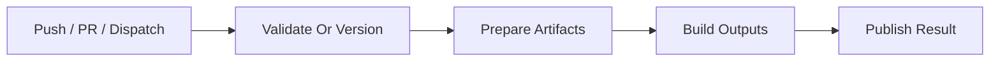
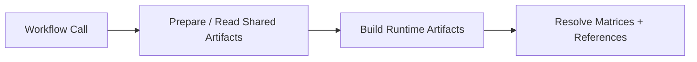
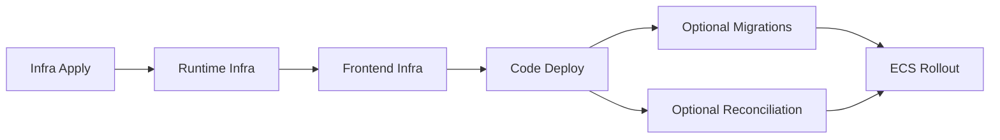

# CI And Workflow Contracts

This is the source of truth for GitHub Actions workflow behavior in this repo.

Use it when you need to understand:

- which workflow to edit
- what each workflow is allowed to do
- which reusable-workflow inputs and outputs are part of the contract
- what downstream feasibility checks to make before changing CI or deploy behavior

## How To Read This

1. Start with `Workflow Groups`.
2. Use the Mermaid diagram in the relevant section for the fast path.
3. Use `Workflow Contracts` and `Feasibility Checks` before changing any workflow or Terragrunt dependency wiring.

## Workflow Groups

- Release and validation: `release.yml`, `pull_request.yml`
- Shared artifact prep and build: `shared_infra_releases.yml`, `shared_build.yml`, `shared_build_get.yml`
- Shared infra and code rollout: `shared_infra.yml`, `shared_deploy.yml`, `shared_directories_get.yml`, `shared_infra_plan_metadata_get.yml`
- Environment entry points: `dev_infra_deploy.yml`, `dev_infra_plan_apply.yml`, `dev_code_deploy.yml`, `prod_infra_deploy.yml`, `prod_infra_plan.yml`, `prod_infra_plan_apply.yml`
- Cleanup: `destroy.yml`

## Workflow Contracts

The repo vendors its internal GitHub Actions under `.github/actions`, so workflow `uses:` references point at local paths rather than external action tags. The release workflow uses a repo-local version action, and the change-detection path uses a repo-local Docker action under `.github/actions/get-changes`.
The reusable infra, build, deploy, and destroy workflows now build `AWS_OIDC_ROLE_ARN` from two GitHub variables, `AWS_ACCOUNT_ID` and `PROJECT_NAME`, plus the workflow environment input. Runtime and deploy steps that need a region should read `AWS_REGION` from GitHub variables instead of hardcoding it in workflow YAML. In this repo the role name comes from `infra/root.hcl`:

```hcl
deploy_role_name = "${local.project_name}-${local.environment}-github-oidc-role"
```

The workflow shape is:

```text
arn:aws:iam::<AWS_ACCOUNT_ID>:role/<PROJECT_NAME>-<environment>-github-oidc-role
```

So for the current repo and environment pattern, examples are:

- `aws-serverless-github-deploy-ci-github-oidc-role`
- `aws-serverless-github-deploy-dev-github-oidc-role`
- `aws-serverless-github-deploy-prod-github-oidc-role`

If you are unsure, the live `aws/oidc` stack in the target environment is the source of truth, since Terragrunt passes `deploy_role_name` into the shared OIDC module from `infra/root.hcl`.

### Release And Validation

- `release.yml`
  Creates release tags, prepares shared CI artifacts, builds release outputs, and publishes the GitHub release. Version bumps come from a repo-local action that scans commit subjects since the latest semver tag and matches configurable major/minor/patch prefixes.
- `pull_request.yml`
  Provides fast validation for workflow syntax, Terraform formatting/linting, changed runtime builds, and a direct execution check of the repo-local `get-next-version` Docker action. The version preview job classifies the PR title, so it reflects the version that would be implied if that PR title lands on `main`. Its `check` job runs the repo-local `get-changes` Docker action directly, using the PR base SHA for a PR-style `base...HEAD` diff. When `.github/actions/**` changed, the workflow reuses `shared_directories_get.yml` to discover action directories with `Dockerfile`s and runs a Docker unit-test matrix for them after the GitHub formatting job. The Lambda naming check only runs when Lambda sources changed, and the ECS task/service pair check runs when container sources or Terragrunt live-stack directories changed; each is an explicit prerequisite for the corresponding build job.

The local version action can also be tested outside GitHub Actions, either by running the Python entrypoint directly or through its dedicated Docker image.



### Shared Artifact Prep And Build

- `shared_infra_releases.yml`
  Prepares or reads shared CI-side artifact infrastructure such as ECR and the code bucket.
- `shared_build.yml`
  Builds and publishes frontend, Lambda, and ECS artifacts.
- `shared_build_get.yml`
  Resolves artifact locations and derives matrices used by downstream deploy wrappers.



### Infra And Code Rollout

- `shared_infra.yml`
  Applies shared stacks first, then runtime stacks, then frontend infrastructure. Shared stacks now include the CloudWatch observability dashboard. The reusable workflow now accepts `tg_action` so the same graph can run a normal apply, upload derived per-stack plan artifacts, or apply from previously uploaded plan artifacts.
- `shared_deploy.yml`
  Rolls out Lambda code, optional migrations, optional reconciliation Lambdas, ECS task and service updates, and optional frontend deploys. The reusable workflow renders its Lambda and ECS CodeDeploy AppSpec files from the shared templates under `config/deploy/`, and its mutating `just` steps should target `justfile.deploy` rather than the repo-root `justfile`.



### Wrapper Workflows

- `dev_infra_deploy.yml`
  Entry point for dev infra apply.
- `dev_infra_plan_apply.yml`
  Entry point for dev infra plan-then-apply. It uploads derived per-stack plan artifacts first, then reruns the same ordered infra graph in apply-from-plan mode.
- `prod_infra_plan.yml`
  Entry point for prod infra plan. It resolves released artifacts from `ci`, records both the exact input versions and the resolved infra graph inputs in a reusable metadata artifact, and uploads derived per-stack plan artifacts for that same resolved set.
- `prod_infra_plan_apply.yml`
  Entry point for prod infra apply-from-plan. It only needs the earlier `plan_run_id`; it reuses the shared metadata-reader workflow to recover the exact resolved infra graph inputs from that run, and then downloads the plan artifacts from that same run.
- `shared_infra_plan_metadata_get.yml`
  Reusable workflow that downloads and parses the shared infra plan metadata artifact from an earlier run and exposes the resolved infra graph inputs as outputs.
- `prod_infra_deploy.yml`
  Entry point for prod infra apply using shared artifacts from `ci`.
- `dev_code_deploy.yml`
  Entry point for dev code build and deploy.
- `prod_code_deploy.yml`
  Entry point for prod code deploy from released artifacts.

### Cleanup And Discovery

- `destroy.yml`
  Tears down app layers before shared dependencies, including the shared observability dashboard.
- `shared_directories_get.yml`
  Derives the directory-based matrices used by wrapper workflows and PR action-test discovery.

## Feasibility Checks

Run these checks on every CI, workflow, or deploy-contract change.

### Reusable Workflow Contracts

- compare every caller `with:` block against the callee `workflow_call.inputs`
- compare expected outputs against actual `jobs.<job>.outputs.*`
- verify optional inputs are intentionally omitted, not accidentally missing
- the repo-local `./.github/actions/terragrunt` action now supports `tg_action: plan` plus automatic artifact upload of the binary plan and rendered text plan; keep that contract in mind before inventing a second plan-storage mechanism
- `./.github/actions/terragrunt` derives its plan artifact name from `tg_directory`, so callers do not need to pass artifact naming inputs
- if `apply_plan` is used across separate workflow runs, pass the earlier workflow `run_id` through `plan_artifact_run_id` and a token with `actions: read` so the plan artifacts can be downloaded
- if a cross-run apply should not ask the operator to re-enter versions or recompute artifact resolution, store both the input versions and the resolved reusable-workflow outputs in a metadata artifact during plan and recover them in the apply wrapper from the earlier `run_id`
- if multiple environments will need the same metadata handoff, prefer a shared metadata-reader reusable workflow over duplicating `download-artifact` and `jq` parsing in each apply wrapper
- when using `./.github/actions/just`, check whether the caller needs the repo-root `justfile` or an explicit `justfile_path`
- if a deploy step passes `APP_SPEC_FILE`, keep it aligned with the shared AppSpec template location under `config/deploy/`
- keep the split `just` ownership clear:
  - repo-root `justfile` for local/developer commands
  - `justfile.ci` for read-only CI helpers
  - `justfile.deploy` for mutating CI build and deploy steps

### Release Tagging Checks

- if `release.yml` uses the local version action, keep its configured commit prefixes aligned with the team's commit convention
- if the allowed PR title prefixes change, update `pull_request.yml` in the same change so the PR gate matches the release bump inputs
- ensure the release job still reads plain semver tags from repo history in the same format it creates

### Repo-Local Docker Action Checks

- if a repo-local action uses `runs.using: docker` and needs to read git state, do not assume a fixed working directory inside the image
- resolve the checkout from `GITHUB_WORKSPACE` first, and otherwise walk up to the nearest `.git` root for local test harnesses
- before running `git` commands against the mounted checkout in GitHub Actions, add that path to git `safe.directory`
- when changing a repo-local Docker action, prefer adding a PR validation job that executes the action itself so the real GitHub container path is exercised

### Runtime Coverage

- if Lambda directories are auto-detected, confirm matching live Terragrunt stacks still exist
- if ECS directories are auto-detected, confirm matching `task_*` and `service_*` live Terragrunt stacks still exist
- for `*_code` wrappers, confirm dispatch inputs cover every runtime being deployed
- if ECS deploys are included, confirm `ecs_version` is exposed or intentionally derived

### Dependency Safety

- check apply, deploy, and destroy behavior, not just apply
- verify downstream consumers of remote state still exist and are ordered correctly
- confirm every `needs.<job>.outputs.*` reference is in scope
- confirm matrix values still match the naming contract expected by workflows and modules
- do not change CI ordering blindly; first check whether the real issue is avoidable cross-stack coupling

### Infra Versus Code Ownership

- `*_infra` wrappers should stop at infrastructure apply
- `shared_deploy.yml` owns feature-code rollout
- prod wrappers should continue reading shared artifact resources from `ci` while applying deploy targets in `prod`
- do not add `shared_infra_releases.yml` to prod deploy wrappers unless the goal is explicitly deploy-time artifact creation

### ECS-Specific Checks

- if helper code is added under `containers/`, confirm discovery logic does not treat it as a deployable image target
- if service topology changes, verify `connection_type`, load-balancer shape, listeners, and CodeDeploy wiring still satisfy the shared ECS feasibility rules

### Destroy-Path Checks

- confirm destroy ordering still removes downstream consumers before shared stacks
- check required Terraform variables on destroy as well as apply
- prefer depending on real downstream consumers rather than serializing unrelated shared stacks

## Wrapper Workflow Summary

These are the workflows most users trigger directly.

- `dev_infra_deploy.yml`
  Discovers directories, prepares dev artifacts, and applies dev infrastructure.
- `dev_infra_plan_apply.yml`
  Discovers directories, prepares dev artifacts, plans the ordered dev infra graph with derived uploaded plan artifacts, and then reapplies the same graph from those artifacts.
- `prod_infra_plan.yml`
  Resolves released artifacts from `ci`, stores both the exact versions and the resolved infra graph inputs in the shared metadata artifact, and plans the ordered prod infra graph, uploading derived per-stack plan artifacts.
- `prod_infra_plan_apply.yml`
  Reads the exact resolved infra graph inputs from metadata in a prior `prod_infra_plan` run via the shared metadata-reader workflow and reapplies the ordered prod infra graph from plan artifacts created by that run.
- `prod_infra_deploy.yml`
  Resolves released artifacts from `ci` and applies prod infrastructure.
- `dev_code_deploy.yml`
  Discovers directories, builds fresh dev artifacts, resolves deploy inputs, and deploys code to dev.
- `prod_code_deploy.yml`
  Resolves released artifacts from `ci` and deploys code to prod.

## Discovery Notes

- `shared_directories_get.yml` is the workflow-level source for directory-derived matrices
- top-level Lambda directories under `lambdas/` are treated as deployable functions, excluding generated build output
- top-level deployable container directories under `containers/` are treated as ECS image targets, excluding helper-only directories such as `lib` and `_shared`
