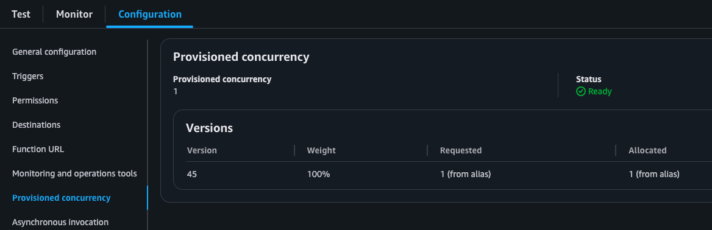
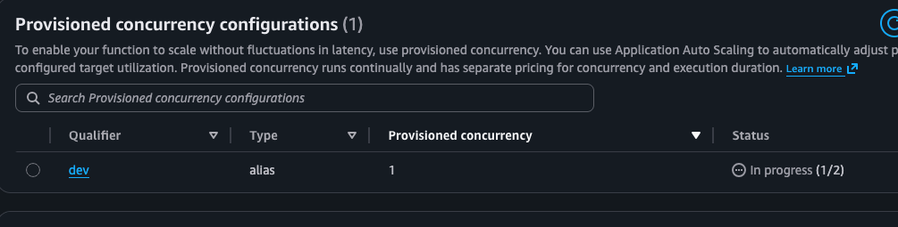
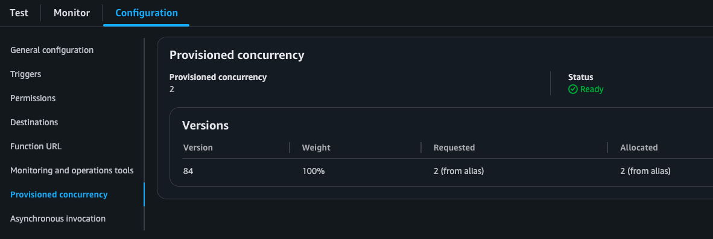

# aws-serverless-github-deploy

**Terraform + GitHub Actions for AWS serverless deployments.**  
Lambda + ECS with CodeDeploy rollouts, plus provisioned concurrency controls for Lambda — driven by clean module variables and `just` recipes.

Workflow dependency diagrams and CI orchestration notes live in [docs/ci/README.md](/Users/chrissheehan/git/chrispsheehan/aws-serverless-github-deploy/docs/ci/README.md).
The repo vendors its internal GitHub Actions under [.github/actions](</Users/chrissheehan/git/chrispsheehan/aws-serverless-github-deploy/.github/actions>), so workflow `uses:` references point at local paths rather than external action tags.

---

## 🚀 setup roles for ci

```sh
just tg ci aws/oidc apply
just tg dev aws/oidc apply
just tg prod aws/oidc apply
```

The `ci` OIDC role is intentionally narrower than the `dev` and `prod` roles. In this repo it is limited to build-artifact management, including the shared code bucket, IAM interactions needed by the existing CI flow, and publishing container images to ECR. It is not the repo's broad deployment role.
The deploy roles for `dev` and `prod` now also include the `rds`, `ssm`, and `secretsmanager` permissions needed by the shared database stack, plus `acm`, `route53`, and `cognito-idp` for the frontend/Cognito custom-domain and auth resources.

## 🧱 prerequisite network

The AWS account must already have the landing-zone or StackSet network in place before deploying this repo.

- the Terraform in this repo reads the VPC and subnets with `data` sources rather than creating them
- the expected VPC and subnets must therefore already exist
- the private subnets must be tagged so the module lookups can find them, for example with names matching `*private*`

If those shared network resources do not exist yet, the infra applies in this repo will fail during data lookup.

The repo `network` module also owns the shared internal ALB and shared HTTP API Gateway surface used by ECS services:

- HTTP API
- default API stage
- VPC link
- internal ALB and target groups
- interface VPC endpoints required by private runtimes, including SQS for the worker poller, SSM for Parameter Store reads where still used, and Secrets Manager for the shared database credentials object consumed by ECS and Lambda runtimes

This repo now includes a sample ECS API container service exposed separately from the Lambda API:

- public Lambda path via CloudFront: `/api/*`
- public ECS path via CloudFront: `/api/ecs/*`
- API Gateway Lambda route namespace: `/*`
- API Gateway ECS route namespace: `/ecs/*`
- deployment model: ECS CodeDeploy `blue_green`
- ALB shape: shared private ALB with a dedicated ECS API listener on port `8080`
- stacks: `task_api` and `service_api`
- the sample frontend calls both backends and renders both responses so the path split is visible in the UI

The `api` module is Lambda-specific and plugs the Lambda integration and root routes into that shared API.

The frontend infra module also uploads a bootstrap `index.html` during infra apply so CloudFront serves a placeholder page before the built frontend assets are deployed.

Terragrunt also provides a shared default ECR repository name to ECS task modules:

- shared artifact base: `dev -> <account>-<region>-<project>-dev`, otherwise `<account>-<region>-<project>-ci`
- default ECR repository: `<artifact_base>-ecs-worker`
- override it in `infra/live/<environment>/environment_vars.hcl` only if the repository naming diverges from that convention
- the concrete ECS worker task wrapper defaults `local_tunnel = false` and `xray_enabled = false` unless you explicitly set them
- in `dev`, `otel_sampling_percentage` is set to `100` so ECS traces are easy to verify while iterating

The reusable deploy workflows follow the same split: `prod` `*_code` and `*_infra` wrappers read shared artifact resources from `ci`, but `*_infra` only applies `prod` infrastructure stacks using the repo's directory-derived service and lambda matrices.
The infra workflow now applies `cognito` before `api`, and the destroy workflow tears Cognito down only after frontend and API consumers are gone so JWT-authenticated routes do not race their auth upstream on destroy.
For frontend DNS, the infra and destroy workflows now read a GitHub environment variable named `DOMAIN_NAME` and pass it into the `frontend` and `cognito` stacks.

For `*_code` release deploys, pass explicit release versions for each runtime you want to roll out. In particular, ECS code deploys should provide an `ecs_version` rather than relying on a Lambda-version fallback.

The worker runtimes now share a dedicated `worker_messaging` stack that owns one SNS topic plus two SQS queues, with one queue consumed by `lambda_worker` and the other by the ECS worker stack. Publishing once to the shared topic fans the same message out to both runtimes independently.
`lambda_worker`, `task_worker`, and `service_worker` now read queue details from `worker_messaging` remote state instead of owning worker queues inside the runtime stacks.
The repo also includes a shared `database` stack in `dev` and `prod` for Aurora PostgreSQL Serverless v2, intended to be available before Lambda or ECS services start taking dependencies on it.
The repo also includes a `cognito` stack for Cognito Hosted UI login, a read-only user group, and JWT protection on the shared API routes.
Database credentials are now managed as a single Secrets Manager object rather than separate username and password parameters, so Lambda, ECS, and debug tooling can all read one credentials payload.
The ECS worker now persists consumed messages into Aurora PostgreSQL, and a separate `migrations` Lambda exists for running schema changes against that shared database from inside the VPC.
The migrations Lambda now packages the `pgroll` CLI from `xataio/pgroll` and runs the checked-in migration definition from the Lambda artifact instead of executing raw SQL directly.
The shared Lambda module now exposes `timeout_seconds`, and `migrations` sets it explicitly to `120` so database work and VPC/database startup do not hit the AWS default 3-second timeout.
When `migrations` is present in the Lambda deployment matrix, the reusable code deploy workflow invokes it automatically after Lambda rollout. ECS task rollout is not serialized behind Lambda or migration jobs unless a workflow adds that explicitly.
CI and deploy workflow Lambda discovery now treats top-level directories under `lambdas/` as deployable functions but explicitly ignores the generated `lambdas/build` directory, so `migrations` is included in the normal Lambda build and deploy flow without polluting the matrix with build artifacts.
For bootstrap service applies, `service_worker` now uses placeholder task and queue values locally rather than spreading `count`-indexed remote-state access through the module.
The ECS worker task uses a local heartbeat-file health check, which is a better fit for a non-HTTP worker than probing a service endpoint or tying task health directly to transient AWS API calls.
All ECS app containers now use a shared tracing helper under `containers/shared` so API requests and worker SQS operations emit X-Ray traces when `xray_enabled = true`.
`containers/shared` is helper code only and is intentionally excluded from the CI ECS image/service discovery matrix.

## 🧪 example prompts

Use prompts like these when asking for a new service in this repo:

- `Add a new ECS service called billing_api exposed on /billing via API Gateway VPC link, with task_billing_api/service_billing_api, canary deploys, and update the docs.`
- `Create a new internal ECS worker called report_worker using task_report_worker/service_report_worker, rolling deploys, and hook it into the existing container build flow.`
- `Add a new Lambda called invoice_sync with its live stacks in dev and prod, wire it into the existing lambda build/deploy workflows, and document the new module contract.`
- `Create a new public Lambda API endpoint for /reports, keep it Lambda-backed rather than ECS, and update the repo docs and workflow expectations.`

## 🛠️ local plan some infra

Given a terragrunt file is found at `infra/live/dev/aws/api/terragrunt.hcl`

```sh
just tg dev aws/api plan
```

## 📨 publish a worker message

To publish directly to the shared worker SNS topic from your shell:

```sh
TOPIC_ARN=arn:aws:sns:eu-west-2:123456789012:aws-serverless-github-deploy-dev-worker-events \
MESSAGE='{"job_id":"demo-1","source":"local","payload":{"hello":"world"}}' \
just sns-publish
```

## 🗃️ run database migrations

The `migrations` Lambda is VPC-attached so it can reach the private Aurora cluster. After the infra stack and Lambda code are deployed, you can run it with the existing invoke recipe:

```sh
AWS_REGION=eu-west-2 \
LAMBDA_NAME=dev-aws-serverless-github-deploy-migrations \
just lambda-invoke
```

To inspect the ECS worker runtime from inside the VPC-connected debug sidecar in `dev`, use:

```sh
just worker-debug-shell dev
```

The shared debug image includes `psql`, and `worker-debug-shell` now injects `PGPASSWORD`, `PGUSER`, and `DB_USER` into the shell from the shared database credentials secret on your local machine before opening ECS Exec.

From inside that shell, a one-line check for persisted worker rows is:

```sh
psql -h "$DB_HOST" -p "$DB_PORT" -U "$PGUSER" -d "$DB_NAME" -c "select count(*) from worker_messages;"
```

## 🔐 frontend auth

The sample frontend now uses Cognito Hosted UI with the authorization-code-plus-PKCE flow.

- unauthenticated users are redirected to Cognito before the app calls `/api/*`
- after sign-in, the frontend exchanges the callback code for tokens and sends `Authorization: Bearer ...` to `/api/*`
- CloudFront still owns the `/api/*` prefix strip, and now explicitly forwards the `Authorization` header to API Gateway

The Cognito stack creates the user pool, app client, Hosted UI domain, and `readonly` group. It does not create actual users automatically. To seed the initial read-only user after `cognito` is applied:

```sh
just cognito-create-readonly-user dev readonly@example.com 'ChangeMe123!'
```

Set the GitHub environment variable `DOMAIN_NAME` to the hosted zone base domain, for example:

```text
chrispsheehan.com
```

The deployed frontend URL is then derived automatically as:

```text
aws-serverless-github-deploy.dev.chrispsheehan.com
```

When that value is present:

- the `frontend` stack requests a CloudFront certificate in `us-east-1` and creates Route53 alias records for `<project_name>.<environment>.<domain_name>`
- the `cognito` stack automatically adds `https://<project_name>.<environment>.<domain_name>` to its Hosted UI callback and logout URLs

The repo still keeps `http://localhost:5173` in Cognito for local Vite development, so local and deployed login can coexist.
For local `vite` dev, the repo includes [`frontend/public/auth-config.json`](</Users/chrissheehan/git/chrispsheehan/aws-serverless-github-deploy/frontend/public/auth-config.json>) as a disabled placeholder; update that file locally if you want the localhost frontend to use the same Cognito flow.

## ⚙️ types of lambda provisioned concurrency

```hcl
module "lambda_example" {
  source = "../lambda"
  ...
  provisioned_config = var.your_provisioned_config
}
```

#### ✅ [default] No provisioned lambdas
- use case: background processes
- we can handle an initial lag while lambda warms up/boots
```hcl
provisioned_config = {
    fixed                = 0
    reserved_concurrency = 2 # only allow 2 concurrent executions THIS ALSO SERVES AS A LIMIT TO AVOID THROTTLING
}
```

#### 🔒 X number of provisioned lambdas
- use case: high predictable usage
- we never want lag due to warm up and can predict traffic
```hcl
provisioned_config = {
    fixed                = 10
    reserved_concurrency = 50
}
```

#### 📈 Scale provisioning when usage exceeds % tolerance 
- use case: react to traffic i.e. api backend
- limit the cost with autoscale.max
- ensure minimal concurrency (no cold starts) with autoscale.min
- set tolerance to amount of used concurrent executions. Below will trigger when 70% are used and add more to meet demands.
- set cool down seconds to reasonable time before you would like the system to react.
```hcl
provisioned_config = {
    auto_scale = {
        max               = 3,
        min               = 1,
        trigger_percent   = 70
        cool_down_seconds = 60
    }
}
```
- before scaling the lambda alias will match the minmum value

- when the trigger percent is exceeded the lambda moves into `In progress (1/2)` state as an additional provisioned lambda is added.

- after scaling the lambda alias will show an additional provisioned lambda



## 🚦 types of lambda deploy

```hcl
module "lambda_example" {
  source = "../_shared/lambda"
  ...
  deployment_config = var.your_deployment_config
}
```

#### ⚡ [default] All at once (fastest):

- use case: background processes
```hcl
deployment_config = {
    strategy = "all_at_once"
}
```

#### 🐤 canary deployment:

- use case: api or service serving traffic
- incrementally rolls out new version to 10% of lambdas and rolls back if errors detected. If not goes to 100%.
- waits to make a decision on health after 1 minute
```hcl
deployment_config = {
    strategy         = "canary"
    percentage       = 10
    interval_minutes = 1
}
```

#### 📶 linear deployment:

- use case: api or service serving traffic
- checks for lambda health on 10% of lambdas and rolls back if errors detected
- rolls out changes on increments of 1 minute
```hcl
deployment_config = {
    strategy         = "linear"
    percentage       = 10
    interval_minutes = 1
}
```

## 🚦 types of ecs deploy

```hcl
module "service_example" {
  source = "../_shared/service"
  ...
  deployment_strategy = var.your_deployment_strategy
}
```

#### ⚡ [default] All at once:

- use case: internal services, queue workers, low-risk changes
- for load-balanced ECS services this uses CodeDeploy and shifts traffic in one step
```hcl
deployment_strategy = "all_at_once"
```

#### 🐤 canary deployment:

- use case: HTTP services behind the load balancer
- shifts 10% of traffic for 5 minutes before moving to 100%
```hcl
deployment_strategy = "canary"
```

#### 📶 linear deployment:

- use case: steady rollout with smaller blast radius
- shifts traffic 10% every minute until complete
```hcl
deployment_strategy = "linear"
```

#### 🟦🟩 blue/green deployment:

- use case: explicit blue/green semantics while still using the default ECS all-at-once traffic switch
- currently maps to the ECS CodeDeploy all-at-once config
```hcl
deployment_strategy = "blue_green"
```

- ECS CodeDeploy is only created for load-balanced ECS services in `_shared/service`
- subpath ECS services need a dedicated ALB listener if they are meant to use CodeDeploy blue/green in this repo
- internal ECS services without load balancer integration should use native ECS rolling updates instead
- infra ignores ECS `task_definition` drift
- for CodeDeploy ECS services, infra also ignores `load_balancer` drift
- for dedicated blue/green listeners, infra also ignores listener `default_action` drift
- the deployment workflow:
  - applies the new `task_*` revision
  - uses CodeDeploy for load-balanced services
  - uses native rolling deploys for internal services

## 🔥↩️ deployment roll-back

- use cloudwatch metrics and alarms to automatically roll-back a deployment
- create a [cloudwatch_metric_alarm](https://registry.terraform.io/providers/hashicorp/aws/latest/docs/resources/cloudwatch_metric_alarm) resource and pass in as per below

```hcl
module "lambda_example" {
  source = "../_shared/lambda"
  ...
  codedeploy_alarm_names = [
    local.api_5xx_alarm_name
  ]
}
```
- the ECS shared service module accepts the same `codedeploy_alarm_names` input
- if the alarm triggers during a deployment you will see the below in the CI

```
📦 Running: lambda-deploy
🚀 Deployment started: d-40UUQH3DF
Attempt 1: Deployment status is InProgress
Attempt 2: Deployment status is InProgress
Attempt 3: Deployment status is InProgress
Attempt 4: Deployment status is InProgress
Attempt 5: Deployment status is Stopped
❌ Deployment d-40UUQH3DF failed or was stopped.
-------------------------------------------------------------------------------------------------------------------------------------------------------------------------------------------------------------------------------------------------------
|                                                                                                                    GetDeployment                                                                                                                    |
+--------------+--------------------------------------------------------------------------------------------------------------------------------------------------------------------------------------------------------------------------------------+
|  ErrorCode   |  ALARM_ACTIVE                                                                                                                                                                                                                        |
|  ErrorMessage|  One or more alarms have been activated according to the Amazon CloudWatch metrics you selected, and the affected deployments have been stopped. Activated alarms: <dev-aws-serverless-github-deploy-api-api-v2-5xx-rate-critical>   |
|  Status      |  Stopped                                                                                                                                                                                                                             |
+--------------+--------------------------------------------------------------------------------------------------------------------------------------------------------------------------------------------------------------------------------------+
error: Recipe `lambda-deploy` failed with exit code 1
Error: Process completed with exit code 1.

```

## 🚢 deployment strategies

- Infrastructure and feature code deployments (via codedeploy) are completely decoupled.
- Initial infrastructure deployments deploys `infra/modules/aws/_shared/lambda/bootstrap/index.py` which serves as a place-holder.
- Initial ECS infrastructure deployments can use a bootstrap task, while the deploy workflow later registers a real `task_*` revision and promotes it via CodeDeploy.
- The code deploy app and group are also deployed, which is the mechanism used to deploy the real builds.
- Subsequent re-runs of the infrastructure deployments will not update the code.
