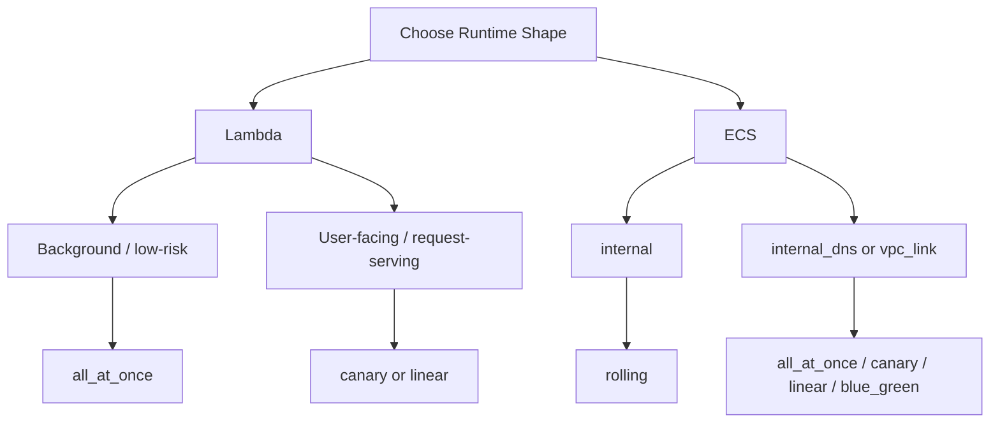

# aws-serverless-github-deploy

**Terraform + GitHub Actions for AWS serverless deployments.**  
Lambda + ECS with CodeDeploy rollouts, plus provisioned concurrency controls for Lambda — driven by clean module variables and `just` recipes.

## Sections

- [Example Prompts](#example-prompts)
- [Overview](#overview)
- [AI-Assisted Usage](#ai-assisted-usage)
- [Prerequisites](#prerequisites)
- [Setup](#setup)
- [Common Tasks](#common-tasks)
- [Frontend Auth](#frontend-auth)
- [Infra Deployment Use Cases](#infra-deployment-use-cases)
- [Reference](#reference)
- [Read This Next](#read-this-next)

## Example Prompts

Use prompts like these when you want an agent to extend the repo without having to spell out every file path up front:

- `Add a new env called qa.`
- `Add a public API that has a home page, a health check, a test failure route, and a way to send a message into the shared worker flow.`
- `Add a background Lambda worker that picks up messages from the shared worker flow and processes them.`
- `Add a Lambda that watches for new Aurora reader instances and copies the database cluster tags onto them automatically.`
- `Add an ECS-based API service for a new feature that is available through the existing shared API setup.`
- `Add an internal ECS worker service that reads from the shared worker queue and saves results to the database.`

Use [CONTRIBUTING.md](CONTRIBUTING.md) for expectations when changing the repo itself, especially for AI-assisted changes.

## Overview

- Terraform/Terragrunt stacks for a typical AWS application shape: APIs, workers, frontend, database, auth, and messaging
- GitHub Actions workflows for infrastructure apply, artifact build, code deploy, and destroy
- shared deployment patterns for Lambda and ECS, with repo-local `just` commands for local and CI operations
- runtime and infrastructure layouts designed to be extended by humans or coding agents without having to rediscover the whole repo each time

## AI-Assisted Usage

This repo is structured to work well with coding agents as well as humans.

- docs are split by ownership so agents can find the right contract before changing code
- the root README is the entry point, while workflow, infra, runtime, and shared-module details live in their own READMEs
- the `just` command surface is split so local commands, read-only CI helpers, and mutating deploy helpers stay distinct

## Prerequisites

The AWS account must already have the landing-zone or StackSet network in place before deploying this repo.

- the Terraform in this repo reads the VPC and subnets with `data` sources rather than creating them
- the expected VPC and subnets must therefore already exist
- the private subnets must be tagged so the module lookups can find them, for example with names matching `*private*`
- if you plan to deploy the frontend custom domain, the matching Route53 hosted zone must also already exist

If those shared network or DNS resources do not exist yet, the infra applies in this repo will fail during data lookup or certificate/DNS creation.

Required shared prerequisites before a full environment deploy:

- pre-existing VPC
- tagged private subnets that the data lookups can resolve
- Route53 hosted zone for the deployed frontend domain when using the frontend custom domain path

## Setup

### Setup Roles For CI

```sh
just tg ci aws/oidc apply
just tg dev aws/oidc apply
just tg prod aws/oidc apply
```

The `ci` OIDC role is intentionally narrower than the `dev` and `prod` roles. The detailed scope contract and the vendored module shape live in [infra/modules/aws/_shared/oidc/README.md](infra/modules/aws/_shared/oidc/README.md).

### Shared Platform Shape

Lambda and ECS APIs can coexist on the shared routing surface in this repo, with CloudFront exposing Lambda-backed `/api/*` paths and ECS-backed `/api/ecs/*` paths independently.

The detailed routing, listener, and feasibility rules live in [infra/modules/aws/network/README.md](infra/modules/aws/network/README.md), [infra/modules/aws/_shared/service/README.md](infra/modules/aws/_shared/service/README.md), and [infra/modules/aws/_shared/task/README.md](infra/modules/aws/_shared/task/README.md).

## Common Tasks

The root [`justfile`](justfile) keeps local developer commands. CI-only helpers live in [`justfile.ci`](justfile.ci), and CI build/deploy helpers live in [`justfile.deploy`](justfile.deploy). Run the split files locally with `--justfile`:

```sh
just --justfile justfile.ci tf-lint-check
just --justfile justfile.deploy lambda-get-version
just --justfile justfile.deploy frontend-build
```

### Local Plan Some Infra

Given a Terragrunt file is found at `infra/live/dev/aws/lambda_api/terragrunt.hcl`

```sh
just tg dev aws/lambda_api plan
```

### Publish A Worker Message

To publish directly to the shared worker SNS topic from your shell:

```sh
TOPIC_ARN=arn:aws:sns:eu-west-2:123456789012:aws-serverless-github-deploy-dev-worker-events \
MESSAGE='{"job_id":"demo-1","source":"local","payload":{"hello":"world"}}' \
just sns-publish
```

Or publish through the public Lambda API:

```sh
curl -X POST \
  -H 'Content-Type: application/json' \
  -d '{"job_id":"demo-1","source":"api","payload":{"hello":"world"}}' \
  https://<your-domain>/api/messages
```

The example frontend also includes an authenticated button that gathers browser metadata, page context, timestamp, and geolocation, then publishes that payload through the same SNS fanout path so both worker runtimes receive it and the ECS worker persists it to Aurora PostgreSQL.

### Run Database Migrations

After the infra stack and Lambda code are deployed:

```sh
AWS_REGION=eu-west-2 \
LAMBDA_NAME=dev-aws-serverless-github-deploy-migrations \
just --justfile justfile.deploy lambda-invoke
```

### Open An ECS Worker Debug Shell

```sh
just worker-debug-shell dev
```

The shared debug image includes `psql`, and `worker-debug-shell` injects `PGPASSWORD`, `PGUSER`, and `DB_USER` into the shell from the shared database credentials secret before opening ECS Exec.

## Frontend Auth

The boilerplate frontend uses Cognito Hosted UI with the authorization-code-plus-PKCE flow. The detailed frontend auth contract, callback/logout URL behavior, and `/api/*` forwarding rules live in [infra/modules/aws/cognito/README.md](infra/modules/aws/cognito/README.md) and [infra/modules/aws/frontend/README.md](infra/modules/aws/frontend/README.md).

The Cognito stack creates the user pool, app client, Hosted UI domain, and `readonly` group. It does not create users automatically. To seed the initial read-only user after `cognito` is applied:

```sh
just cognito-create-readonly-user dev readonly@example.com 'ChangeMe123!'
```

Set the GitHub environment variable `DOMAIN_NAME` to the hosted zone base domain, for example:

```text
chrispsheehan.com
```

When that value is present, the frontend and Cognito stacks derive the deployed domain and auth callback/logout URLs automatically. Local Vite login still coexists through `http://localhost:5173`.

## Infra Deployment Use Cases

For focused infra changes such as:

- upgrading the database
- changing a Lambda env var
- adding an API route
- changing a security group

see [infra/README.md](infra/README.md#infra-deployment-use-cases).

## Reference

For Lambda provisioned concurrency patterns and example `provisioned_config` shapes, see [infra/modules/aws/_shared/lambda/README.md](infra/modules/aws/_shared/lambda/README.md).

For ECS scaling patterns and `scaling_strategy` examples, see [infra/modules/aws/_shared/service/README.md](infra/modules/aws/_shared/service/README.md).
For Aurora recovery posture presets such as `dev`, `standard`, and `critical`, plus the optional restore-drill Step Functions skeleton, see [infra/modules/aws/_shared/database/README.md](infra/modules/aws/_shared/database/README.md).

### Deployment Model

Infrastructure apply and feature-code rollout are intentionally decoupled in this boilerplate.

- infra workflows create the stable runtime shape, including the Lambda and ECS CodeDeploy applications and deployment groups used later for real rollouts
- `*_infra` workflows apply infrastructure only
- `*_code` workflows deploy feature code only
- code deploy workflows publish the real Lambda versions and ECS task revisions into that pre-created deploy surface
- saved infra plans are stored in the shared S3 code bucket under `terragrunt_plan/<environment>/<run_id>/...`, using the same artifact split as build outputs: `dev` writes to the `dev` code bucket and non-`dev` environments reuse the `ci` code bucket
- Code artifact retention and infra-plan retention are configured separately in the shared code bucket module
- rerunning infrastructure apply does not roll out new feature code
- the shared Lambda and ECS module READMEs are the canonical source for bootstrap, rollout, and rollback details for each runtime shape
- detailed workflow contracts, reusable-workflow inputs, repo-local action behavior, and `justfile_path` rules live in [.github/docs/README.md](.github/docs/README.md)
- see [lambdas/README.md](lambdas/README.md) and [containers/README.md](containers/README.md) for runtime source layout, build behavior, and boilerplate patterns

### Deployment Overview



## Read This Next

- CI contracts and feasibility checks: [.github/docs/README.md](.github/docs/README.md)
- Lambda source layout: [lambdas/README.md](lambdas/README.md)
- Container source layout: [containers/README.md](containers/README.md)
- Infra layout and stack glossary: [infra/README.md](infra/README.md)
- OIDC role ownership and setup contract: [infra/modules/aws/_shared/oidc/README.md](infra/modules/aws/_shared/oidc/README.md)
- Shared Lambda deployment and provisioned concurrency behavior: [infra/modules/aws/_shared/lambda/README.md](infra/modules/aws/_shared/lambda/README.md)
- Shared ECS deployment and scaling behavior: [infra/modules/aws/_shared/service/README.md](infra/modules/aws/_shared/service/README.md)
- Shared network and routing surface: [infra/modules/aws/network/README.md](infra/modules/aws/network/README.md)
- Frontend auth and hosting contracts: [infra/modules/aws/cognito/README.md](infra/modules/aws/cognito/README.md) and [infra/modules/aws/frontend/README.md](infra/modules/aws/frontend/README.md)
- Shared runtime log dashboard for the primary Lambda and ECS request/worker runtimes, with default views biased toward structured app events instead of Lambda platform noise: [infra/modules/aws/observability/README.md](infra/modules/aws/observability/README.md)
