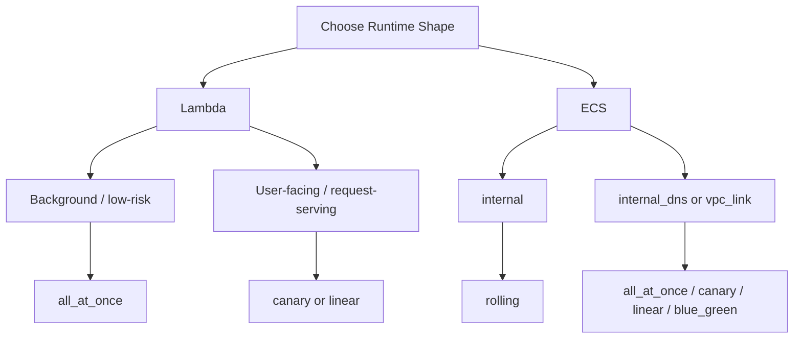

# aws-serverless-github-deploy

**Terraform + GitHub Actions for AWS serverless deployments.**  
Lambda + ECS with CodeDeploy rollouts, plus provisioned concurrency controls for Lambda — driven by clean module variables and `just` recipes.

Workflow dependency diagrams and CI orchestration notes live in [docs/ci/README.md](/Users/chrissheehan/git/chrispsheehan/aws-serverless-github-deploy/docs/ci/README.md).
The repo vendors its internal GitHub Actions under [.github/actions](</Users/chrissheehan/git/chrispsheehan/aws-serverless-github-deploy/.github/actions>), so workflow `uses:` references point at local paths rather than external action tags.

---

## 🚀 setup roles for ci

```sh
just tg ci aws/oidc apply
just tg dev aws/oidc apply
just tg prod aws/oidc apply
```

The `ci` OIDC role is intentionally narrower than the `dev` and `prod` roles. In this repo it is limited to build-artifact management, including the shared code bucket, IAM interactions needed by the existing CI flow, and publishing container images to ECR. It is not the repo's broad deployment role.

Role scope summary:

- `ci`: shared code bucket access, current CI IAM interactions, and ECR image publishing
- `dev` and `prod`: deploy scope plus the `rds`, `ssm`, `secretsmanager`, and `kms` permissions needed by the shared database stack
- `dev` and `prod`: also include `acm`, `route53`, and `cognito-idp` for the frontend and Cognito custom-domain/auth resources

## 🧱 prerequisite network

The AWS account must already have the landing-zone or StackSet network in place before deploying this repo.

- the Terraform in this repo reads the VPC and subnets with `data` sources rather than creating them
- the expected VPC and subnets must therefore already exist
- the private subnets must be tagged so the module lookups can find them, for example with names matching `*private*`
- if you plan to deploy the frontend custom domain, the matching Route53 hosted zone must also already exist

If those shared network or DNS resources do not exist yet, the infra applies in this repo will fail during data lookup or certificate/DNS creation.

The repo `network` module also owns the shared internal ALB and shared HTTP API Gateway surface used by ECS services:

- HTTP API
- default API stage
- VPC link
- internal ALB and target groups
- interface VPC endpoints required by private runtimes, including SQS for the worker poller, SSM for Parameter Store reads where still used, and Secrets Manager for the shared database credentials object consumed by ECS and Lambda runtimes

This boilerplate supports Lambda APIs and ECS services side by side on the shared routing surface. A typical ECS API shape in this repo looks like:

- public Lambda path via CloudFront: `/api/*`
- public ECS path via CloudFront: `/api/ecs/*`
- API Gateway Lambda route namespace: `/*`
- API Gateway ECS route namespace: `/ecs/*`
- deployment model: ECS CodeDeploy `blue_green`
- ALB shape: shared private ALB with a dedicated ECS API listener on port `8080`
- stacks: `task_<name>` and `service_<name>`
- frontend and routing layers can expose Lambda-backed and ECS-backed paths independently

The `lambda_api` family plugs Lambda integrations and routes into that shared API, while `network` owns the shared Cognito-backed JWT authorizer used by both Lambda and ECS API routes.

The frontend infra module also uploads a bootstrap `index.html` during infra apply so CloudFront serves a placeholder page before the built frontend assets are deployed.

Required shared prerequisites before a full environment deploy:

- pre-existing VPC
- tagged private subnets that the data lookups can resolve
- Route53 hosted zone for the deployed frontend domain when using the frontend custom domain path

Terragrunt also provides a shared default ECR repository name to ECS task modules:

- shared artifact base: `dev -> <account>-<region>-<project>-dev`, otherwise `<account>-<region>-<project>-ci`
- default ECR repository: `<artifact_base>-ecs-worker`
- override it in `infra/live/<environment>/environment_vars.hcl` only if the repository naming diverges from that convention
- the concrete ECS worker task wrapper defaults `local_tunnel = false` and `xray_enabled = false` unless you explicitly set them
- in `dev`, `otel_sampling_percentage` is set to `100` so ECS traces are easy to verify while iterating

The reusable deploy workflows follow the same split: `prod` `*_code` and `*_infra` wrappers read shared artifact resources from `ci`, but `*_infra` only applies `prod` infrastructure stacks using the repo's directory-derived service and lambda matrices.
The infra workflow now applies `cognito` before `network` so the shared HTTP API authorizer can be created centrally, and the destroy workflow tears Cognito down only after `network` and frontend consumers are gone so JWT-authenticated routes do not race their auth upstream on destroy.
For frontend DNS, the infra and destroy workflows now read a GitHub environment variable named `DOMAIN_NAME` and pass it into the `frontend` and `cognito` stacks.

For `*_code` release deploys, pass explicit release versions for each runtime you want to roll out. In particular, ECS code deploys should provide an `ecs_version` rather than relying on a Lambda-version fallback.

Shared stack patterns:

- `worker_messaging` is the shared SNS-plus-SQS fanout pattern for Lambda and ECS worker runtimes.
- `database` is the shared Aurora PostgreSQL pattern for runtimes that need relational storage.
- `cognito` is the shared Hosted UI and JWT-auth pattern for frontend and API protection.

Migration flow:

- `migrations` is the boilerplate Lambda shape for schema changes against the shared database.
- it uses packaged SQLAlchemy models, not an external migration CLI.
- it sets `timeout_seconds = 120` to avoid the default 3-second Lambda timeout during database and VPC startup.
- when `migrations` is in the Lambda deploy matrix, the reusable code deploy workflow invokes it after Lambda rollout.
- ECS rollout is not implicitly blocked on Lambda or migration jobs unless a workflow adds that ordering.
- Lambda discovery includes top-level directories under `lambdas/` but ignores the generated `lambdas/build` directory, so `migrations` participates in normal Lambda build and deploy flow without polluting the matrix.

ECS runtime notes:

- bootstrap-friendly ECS service applies can use placeholder task and dependency values instead of forcing early remote-state coupling.
- non-HTTP worker tasks can use a local heartbeat-file health check rather than probing a service endpoint.
- shared tracing helpers live under `containers/shared`, so ECS APIs and workers can emit X-Ray traces when `xray_enabled = true`.
- `containers/shared` is helper code only and is intentionally excluded from the CI ECS image and service discovery matrix.

## 🧪 example prompts

Use prompts like these when asking for a new service in this repo:

- `Add a new env called qa.`
- `Add an API call that puts a message on a queue so a worker can pick it up and write it to the database.`
- `Add a new public API endpoint for reports.`
- `Add a new internal worker for report processing.`
- `Add a new ECS service for billing under /billing.`

## 🛠️ local plan some infra

Given a terragrunt file is found at `infra/live/dev/aws/lambda_api/terragrunt.hcl`

```sh
just tg dev aws/lambda_api plan
```

## 📨 publish a worker message

To publish directly to the shared worker SNS topic from your shell:

```sh
TOPIC_ARN=arn:aws:sns:eu-west-2:123456789012:aws-serverless-github-deploy-dev-worker-events \
MESSAGE='{"job_id":"demo-1","source":"local","payload":{"hello":"world"}}' \
just sns-publish
```

## 🗃️ run database migrations

The `migrations` Lambda is VPC-attached so it can reach the private Aurora cluster. After the infra stack and Lambda code are deployed, you can run it with the existing invoke recipe:

```sh
AWS_REGION=eu-west-2 \
LAMBDA_NAME=dev-aws-serverless-github-deploy-migrations \
just lambda-invoke
```

To inspect the ECS worker runtime from inside the VPC-connected debug sidecar in `dev`, use:

```sh
just worker-debug-shell dev
```

The shared debug image includes `psql`, and `worker-debug-shell` now injects `PGPASSWORD`, `PGUSER`, and `DB_USER` into the shell from the shared database credentials secret on your local machine before opening ECS Exec.
`worker-debug-shell` resolves the live database credentials secret ARN from the Aurora cluster metadata, so it continues to work even though Aurora now owns the underlying secret name.

From inside that shell, a one-line check for persisted worker rows is:

```sh
psql -h "$DB_HOST" -p "$DB_PORT" -U "$PGUSER" -d "$DB_NAME" -c "select count(*) from worker_messages;"
```

## 🔐 frontend auth

The sample frontend now uses Cognito Hosted UI with the authorization-code-plus-PKCE flow.

- unauthenticated users are redirected to Cognito before the app calls `/api/*`
- after sign-in, the frontend exchanges the callback code for tokens and sends `Authorization: Bearer ...` to `/api/*`
- if Cognito returns `invalid_grant` during callback exchange or refresh, the frontend clears the stale browser auth state and starts a fresh login instead of staying stuck on an auth error
- CloudFront still owns the `/api/*` prefix strip, and now explicitly forwards the `Authorization` header to API Gateway

The Cognito stack creates the user pool, app client, Hosted UI domain, and `readonly` group. It does not create actual users automatically. To seed the initial read-only user after `cognito` is applied:

```sh
just cognito-create-readonly-user dev readonly@example.com 'ChangeMe123!'
```

The recipe is safe to re-run for an existing user. The password you pass still needs to satisfy the user-pool password policy, for example including an uppercase character.

Set the GitHub environment variable `DOMAIN_NAME` to the hosted zone base domain, for example:

```text
chrispsheehan.com
```

The deployed frontend URL is then derived automatically as:

```text
aws-serverless-github-deploy.dev.chrispsheehan.com
```

When that value is present:

- the `frontend` stack requests a CloudFront certificate in `us-east-1` and creates Route53 alias records for `<project_name>.<environment>.<domain_name>`
- the `cognito` stack automatically adds `https://<project_name>.<environment>.<domain_name>` to its Hosted UI callback and logout URLs

The repo still keeps `http://localhost:5173` in Cognito for local Vite development, so local and deployed login can coexist.
For local `vite` dev, the repo includes [`frontend/public/auth-config.json`](</Users/chrissheehan/git/chrispsheehan/aws-serverless-github-deploy/frontend/public/auth-config.json>) as a disabled placeholder; update that file locally if you want the localhost frontend to use the same Cognito flow.

## ⚙️ types of lambda provisioned concurrency

```hcl
module "lambda_example" {
  source = "../lambda"
  ...
  provisioned_config = var.your_provisioned_config
}
```

#### ✅ [default] No provisioned lambdas
- use case: background processes
- we can handle an initial lag while lambda warms up/boots
```hcl
provisioned_config = {
    fixed                = 0
    reserved_concurrency = 2 # only allow 2 concurrent executions THIS ALSO SERVES AS A LIMIT TO AVOID THROTTLING
}
```

#### 🔒 X number of provisioned lambdas
- use case: high predictable usage
- we never want lag due to warm up and can predict traffic
```hcl
provisioned_config = {
    fixed                = 10
    reserved_concurrency = 50
}
```

#### 📈 Scale provisioning when usage exceeds % tolerance 
- use case: react to traffic i.e. api backend
- limit the cost with autoscale.max
- ensure minimal concurrency (no cold starts) with autoscale.min
- set tolerance to amount of used concurrent executions. Below will trigger when 70% are used and add more to meet demands.
- set cool down seconds to reasonable time before you would like the system to react.
```hcl
provisioned_config = {
    auto_scale = {
        max               = 3,
        min               = 1,
        trigger_percent   = 70
        cool_down_seconds = 60
    }
}
```
- before scaling the lambda alias will match the minmum value

- when the trigger percent is exceeded the lambda moves into `In progress (1/2)` state as an additional provisioned lambda is added.

- after scaling the lambda alias will show an additional provisioned lambda


## 🚦 deployment overview



- Lambda deployment rules live in [infra/modules/aws/_shared/lambda/README.md](/Users/chrissheehan/git/chrispsheehan/aws-serverless-github-deploy/infra/modules/aws/_shared/lambda/README.md)
- ECS deployment strategy and connection-type rules live in [infra/modules/aws/_shared/service/README.md](/Users/chrissheehan/git/chrispsheehan/aws-serverless-github-deploy/infra/modules/aws/_shared/service/README.md)
- use the shared module READMEs as the canonical technical source for deployment decisions and feasibility checks

## 🔥↩️ deployment roll-back

- use cloudwatch metrics and alarms to automatically roll-back a deployment
- create a [cloudwatch_metric_alarm](https://registry.terraform.io/providers/hashicorp/aws/latest/docs/resources/cloudwatch_metric_alarm) resource and pass in as per below

```hcl
module "lambda_example" {
  source = "../_shared/lambda"
  ...
  codedeploy_alarm_names = [
    local.api_5xx_alarm_name
  ]
}
```
- the ECS shared service module accepts the same `codedeploy_alarm_names` input
- if the alarm triggers during a deployment you will see the below in the CI

```
📦 Running: lambda-deploy
🚀 Deployment started: d-40UUQH3DF
Attempt 1: Deployment status is InProgress
Attempt 2: Deployment status is InProgress
Attempt 3: Deployment status is InProgress
Attempt 4: Deployment status is InProgress
Attempt 5: Deployment status is Stopped
❌ Deployment d-40UUQH3DF failed or was stopped.
-------------------------------------------------------------------------------------------------------------------------------------------------------------------------------------------------------------------------------------------------------
|                                                                                                                    GetDeployment                                                                                                                    |
+--------------+--------------------------------------------------------------------------------------------------------------------------------------------------------------------------------------------------------------------------------------+
|  ErrorCode   |  ALARM_ACTIVE                                                                                                                                                                                                                        |
|  ErrorMessage|  One or more alarms have been activated according to the Amazon CloudWatch metrics you selected, and the affected deployments have been stopped. Activated alarms: <dev-aws-serverless-github-deploy-api-api-v2-5xx-rate-critical>   |
|  Status      |  Stopped                                                                                                                                                                                                                             |
+--------------+--------------------------------------------------------------------------------------------------------------------------------------------------------------------------------------------------------------------------------------+
error: Recipe `lambda-deploy` failed with exit code 1
Error: Process completed with exit code 1.

```

## 🚢 deployment strategies

- Infrastructure applies and feature-code rollouts are intentionally decoupled in this boilerplate.
- Shared module READMEs document the bootstrap and rollout details for each runtime shape.
- The code deploy app and group are also deployed, which is the mechanism used to deploy the real builds.
- Subsequent re-runs of the infrastructure deployments will not update the code.
