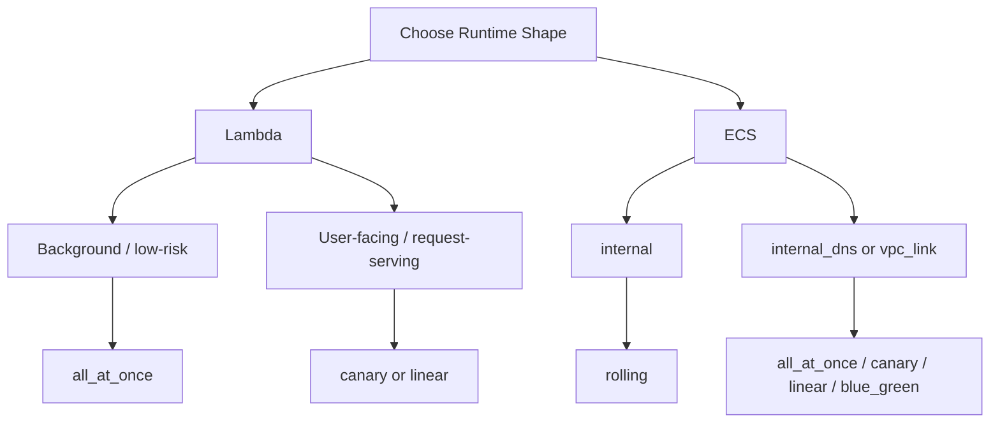

# aws-serverless-github-deploy

**Terraform + GitHub Actions for AWS serverless deployments.**  
Lambda + ECS with CodeDeploy rollouts, plus provisioned concurrency controls for Lambda — driven by clean module variables and `just` recipes.

## What This Repo Gives You

- shared Terraform/Terragrunt patterns for Lambda, ECS, frontend, database, auth, and messaging
- event-driven and directly invokable automation hooks around shared infrastructure, such as helper Lambdas for reconciliation tasks
- GitHub Actions workflows for infra apply, artifact build, code deploy, and destroy
- shared deployment contracts for Lambda and ECS
- boilerplate runtime layouts for Lambda functions and ECS services
- shared JSON logging for Lambda and ECS runtimes through CloudWatch
- async worker paths can propagate trace headers from `lambda_api` through SNS/SQS into the ECS worker and its database span

That async trace propagation uses the AWS X-Ray OpenTelemetry propagator so ECS consumers can continue the AWS-native trace context emitted from the Lambda side, rather than only understanding W3C `traceparent` headers.

## Read This Next

- CI contracts and feasibility checks: [.github/docs/README.md](.github/docs/README.md)
- Lambda source layout: [lambdas/README.md](lambdas/README.md)
- Container source layout: [containers/README.md](containers/README.md)
- Infra layout and stack glossary: [infra/README.md](infra/README.md)
- OIDC role ownership and setup contract: [infra/modules/aws/_shared/oidc/README.md](infra/modules/aws/_shared/oidc/README.md)
- Shared Lambda deployment and provisioned concurrency behavior: [infra/modules/aws/_shared/lambda/README.md](infra/modules/aws/_shared/lambda/README.md)
- Shared network and routing surface: [infra/modules/aws/network/README.md](infra/modules/aws/network/README.md)
- Frontend auth and hosting contracts: [infra/modules/aws/cognito/README.md](infra/modules/aws/cognito/README.md) and [infra/modules/aws/frontend/README.md](infra/modules/aws/frontend/README.md)
- Shared runtime log dashboard for the primary Lambda and ECS request/worker runtimes, with default views biased toward structured app events instead of Lambda platform noise: [infra/modules/aws/observability/README.md](infra/modules/aws/observability/README.md)

## Prerequisites

The AWS account must already have the landing-zone or StackSet network in place before deploying this repo.

- the Terraform in this repo reads the VPC and subnets with `data` sources rather than creating them
- the expected VPC and subnets must therefore already exist
- the private subnets must be tagged so the module lookups can find them, for example with names matching `*private*`
- if you plan to deploy the frontend custom domain, the matching Route53 hosted zone must also already exist

If those shared network or DNS resources do not exist yet, the infra applies in this repo will fail during data lookup or certificate/DNS creation.

Required shared prerequisites before a full environment deploy:

- pre-existing VPC
- tagged private subnets that the data lookups can resolve
- Route53 hosted zone for the deployed frontend domain when using the frontend custom domain path

## Setup

### Setup Roles For CI

```sh
just tg ci aws/oidc apply
just tg dev aws/oidc apply
just tg prod aws/oidc apply
```

The `ci` OIDC role is intentionally narrower than the `dev` and `prod` roles. The detailed scope contract and the vendored module shape live in [infra/modules/aws/_shared/oidc/README.md](infra/modules/aws/_shared/oidc/README.md).

### Shared Platform Shape

- `network` owns the shared HTTP API, JWT authorizer, VPC link, internal ALB, and VPC endpoints used by the app stacks.
- Lambda and ECS APIs can coexist on that shared routing surface, with the frontend exposing Lambda-backed `/api/*` paths and ECS-backed `/api/ecs/*` paths independently.
- ECS task wrappers use a shared default ECR naming convention from `infra/root.hcl`, and the concrete task wrappers default `local_tunnel = false` and `xray_enabled = false` unless an environment opts in.
- The detailed routing, listener, and feasibility rules live in [infra/modules/aws/network/README.md](infra/modules/aws/network/README.md), [infra/modules/aws/_shared/service/README.md](infra/modules/aws/_shared/service/README.md), and [infra/modules/aws/_shared/task/README.md](infra/modules/aws/_shared/task/README.md).

### Workflow Split

- `*_infra` workflows apply infrastructure only
- `*_code` workflows deploy feature code only
- infra re-runs do not roll out new code
- detailed workflow contracts, reusable-workflow inputs, repo-local action behavior, and `justfile_path` rules live in [.github/docs/README.md](.github/docs/README.md)

See [lambdas/README.md](lambdas/README.md) and [containers/README.md](containers/README.md) for runtime source layout, build behavior, and boilerplate patterns.

## Common Tasks

The root [`justfile`](justfile) keeps local developer commands. CI-only helpers live in [`justfile.ci`](justfile.ci), and CI build/deploy helpers live in [`justfile.deploy`](justfile.deploy). Run the split files locally with `--justfile`:

```sh
just --justfile justfile.ci tf-lint-check
just --justfile justfile.deploy lambda-get-version
just --justfile justfile.deploy frontend-build
```

### Local Plan Some Infra

Given a Terragrunt file is found at `infra/live/dev/aws/lambda_api/terragrunt.hcl`

```sh
just tg dev aws/lambda_api plan
```

### Publish A Worker Message

To publish directly to the shared worker SNS topic from your shell:

```sh
TOPIC_ARN=arn:aws:sns:eu-west-2:123456789012:aws-serverless-github-deploy-dev-worker-events \
MESSAGE='{"job_id":"demo-1","source":"local","payload":{"hello":"world"}}' \
just sns-publish
```

Or publish through the public Lambda API:

```sh
curl -X POST \
  -H 'Content-Type: application/json' \
  -d '{"job_id":"demo-1","source":"api","payload":{"hello":"world"}}' \
  https://<your-domain>/api/messages
```

The example frontend also includes an authenticated button that gathers browser metadata, page context, timestamp, and geolocation, then publishes that payload through the same SNS fanout path so both worker runtimes receive it and the ECS worker persists it to Aurora PostgreSQL.

### Run Database Migrations

After the infra stack and Lambda code are deployed:

```sh
AWS_REGION=eu-west-2 \
LAMBDA_NAME=dev-aws-serverless-github-deploy-migrations \
just --justfile justfile.deploy lambda-invoke
```

### Open An ECS Worker Debug Shell

```sh
just worker-debug-shell dev
```

The shared debug image includes `psql`, and `worker-debug-shell` injects `PGPASSWORD`, `PGUSER`, and `DB_USER` into the shell from the shared database credentials secret before opening ECS Exec.

## Frontend Auth

The boilerplate frontend uses Cognito Hosted UI with the authorization-code-plus-PKCE flow. The detailed frontend auth contract, callback/logout URL behavior, and `/api/*` forwarding rules live in [infra/modules/aws/cognito/README.md](infra/modules/aws/cognito/README.md) and [infra/modules/aws/frontend/README.md](infra/modules/aws/frontend/README.md).

The Cognito stack creates the user pool, app client, Hosted UI domain, and `readonly` group. It does not create users automatically. To seed the initial read-only user after `cognito` is applied:

```sh
just cognito-create-readonly-user dev readonly@example.com 'ChangeMe123!'
```

Set the GitHub environment variable `DOMAIN_NAME` to the hosted zone base domain, for example:

```text
chrispsheehan.com
```

When that value is present:

- the `frontend` stack requests a CloudFront certificate in `us-east-1` and creates Route53 alias records for `<project_name>.<environment>.<domain_name>`
- the `cognito` stack automatically adds `https://<project_name>.<environment>.<domain_name>` to its Hosted UI callback and logout URLs

The repo still keeps `http://localhost:5173` in Cognito for local Vite development, so local and deployed login can coexist.

## Example Prompts

Use prompts like these when asking for a new service in this repo:

- `Add a new env called qa.`
- `Add an API call that puts a message on a queue so a worker can pick it up and write it to the database.`
- `Add a new public API endpoint for reports.`
- `Add a new internal worker for report processing.`
- `Add a new ECS service for billing under /billing.`

## Reference

For Lambda provisioned concurrency patterns and example `provisioned_config` shapes, see [infra/modules/aws/_shared/lambda/README.md](infra/modules/aws/_shared/lambda/README.md).

### Types Of ECS Service Scaling

```hcl
module "service_example" {
  source = "../_shared/service"
  ...
  desired_task_count = 1
  scaling_strategy   = var.your_scaling_strategy
}
```

#### ✅ [default] Fixed task count
- use case: predictable workloads or low-volume services
- keep a fixed baseline task count and disable autoscaling
```hcl
desired_task_count = 1

scaling_strategy = {}
```

#### 🧠 Scale on CPU
- use case: services where CPU saturation is the clearest scale signal
```hcl
desired_task_count = 1

scaling_strategy = {
  max_scaled_task_count = 4
  cpu = {
    scale_out_threshold  = 70
    scale_in_threshold   = 30
    scale_out_adjustment = 1
    scale_in_adjustment  = -1
    cooldown_out         = 120
    cooldown_in          = 300
  }
}
```

#### 📨 Scale on SQS depth
- use case: queue-driven workers
```hcl
desired_task_count = 1

scaling_strategy = {
  max_scaled_task_count = 6
  sqs = {
    queue_name           = "my-worker-queue"
    scale_out_threshold  = 10
    scale_in_threshold   = 0
    scale_out_adjustment = 1
    scale_in_adjustment  = -1
    cooldown_out         = 60
    cooldown_in          = 300
  }
}
```

#### 🌐 Scale on ALB requests per task
- use case: load-balanced HTTP services
```hcl
desired_task_count = 2

scaling_strategy = {
  max_scaled_task_count = 6
  alb = {
    target_requests_per_task = 100
    cooldown_out             = 60
    cooldown_in              = 300
  }
}
```

- detailed ECS scaling and deployment rules live in [infra/modules/aws/_shared/service/README.md](infra/modules/aws/_shared/service/README.md)

### Deployment Overview



- Lambda deployment rules live in [infra/modules/aws/_shared/lambda/README.md](infra/modules/aws/_shared/lambda/README.md)
- ECS deployment strategy and connection-type rules live in [infra/modules/aws/_shared/service/README.md](infra/modules/aws/_shared/service/README.md)
- use the shared module READMEs as the canonical technical source for deployment decisions and feasibility checks

### Deployment Rollback

- use cloudwatch metrics and alarms to automatically roll-back a deployment
- create a [cloudwatch_metric_alarm](https://registry.terraform.io/providers/hashicorp/aws/latest/docs/resources/cloudwatch_metric_alarm) resource and pass in as per below

```hcl
module "lambda_example" {
  source = "../_shared/lambda"
  ...
  codedeploy_alarm_names = [
    local.api_5xx_alarm_name
  ]
}
```
- the ECS shared service module accepts the same `codedeploy_alarm_names` input
- alarm-driven rollback behavior is part of the shared Lambda and ECS deploy contracts

### Deployment Model

- Infrastructure applies and feature-code rollouts are intentionally decoupled in this boilerplate.
- Shared module READMEs document the bootstrap and rollout details for each runtime shape.
- The code deploy app and group are also deployed, which is the mechanism used to deploy the real builds.
- Subsequent re-runs of the infrastructure deployments will not update the code.
