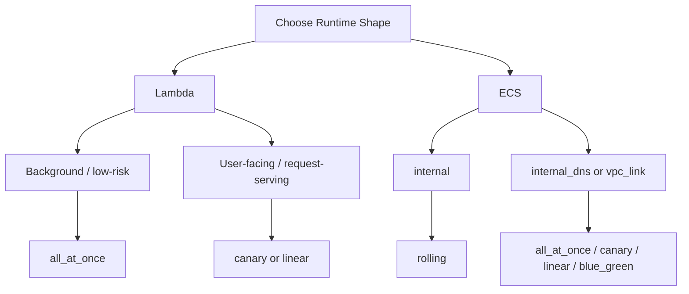

# aws-serverless-github-deploy

**Terraform + GitHub Actions for AWS serverless deployments.**  
Lambda + ECS with CodeDeploy rollouts, plus provisioned concurrency controls for Lambda — driven by clean module variables and `just` recipes.

## Sections

- [For AI Agents](#for-ai-agents)
- [Overview](#overview)
- [Prerequisites](#prerequisites)
- [Setup](#setup)
- [Common Tasks](#common-tasks)
- [Frontend Auth](#frontend-auth)
- [Infra Deployment Use Cases](#infra-deployment-use-cases)
- [Reference](#reference)
- [Read This Next](#read-this-next)

## Overview

- Terraform/Terragrunt stacks for a typical AWS application shape: APIs, workers, frontend, database, auth, and messaging
- GitHub Actions workflows for infrastructure apply, artifact build, code deploy, and destroy
- shared deployment patterns for Lambda and ECS, with repo-local `just` commands for local and CI operations
- runtime and infrastructure layouts designed to be extended without having to rediscover the whole repo each time

## Bootstrap-Friendly Plans

For cross-stack contracts that often block CI plans before upstream stacks exist, this repo prefers Terragrunt `dependency` wiring in the live stack plus `mock_outputs` for non-mutating commands such as `plan` and `validate`. The Terraform modules should consume explicit inputs rather than reaching back into sibling stack state directly when the contract needs bootstrap-friendly plan behavior.

Use [CONTRIBUTING.md](CONTRIBUTING.md) for expectations when changing the repo itself.

## For AI Agents

Example prompts:

```text
add a new environment called qa
```

```text
Give me a site with a backend and a database
```

```text
look at ../sandbox and tell me how to deploy
```

## Prerequisites

The AWS account must already have the landing-zone or StackSet network in place before deploying this repo.

- the Terraform in this repo reads the VPC and subnets with `data` sources rather than creating them
- the expected VPC and subnets must therefore already exist
- the private subnets must be tagged so the module lookups can find them, for example with names matching `*private*`
- if you plan to deploy the frontend custom domain, the matching Route53 hosted zone must also already exist

If those shared network or DNS resources do not exist yet, the infra applies in this repo will fail during data lookup or certificate/DNS creation.

Required shared prerequisites before a full environment deploy:

- pre-existing VPC
- tagged private subnets that the data lookups can resolve
- Route53 hosted zone for the deployed frontend domain when using the frontend custom domain path

## Setup

### Setup Roles For CI

```sh
just tg ci aws/oidc apply
just tg dev aws/oidc apply
just tg prod aws/oidc apply
```

The `ci` OIDC role is intentionally narrower than the `dev` and `prod` roles. The detailed scope contract and the vendored module shape live in [infra/modules/aws/_shared/oidc/README.md](infra/modules/aws/_shared/oidc/README.md).

### Shared Platform Shape

Lambda and ECS APIs can coexist on the shared routing surface in this repo, with CloudFront exposing Lambda-backed `/api/*` paths and ECS-backed `/api/ecs/*` paths independently.

The detailed routing, listener, and feasibility rules live in [infra/modules/aws/network/README.md](infra/modules/aws/network/README.md), [infra/modules/aws/_shared/service/README.md](infra/modules/aws/_shared/service/README.md), and [infra/modules/aws/_shared/task/README.md](infra/modules/aws/_shared/task/README.md).

## Common Tasks

The root [`justfile`](justfile) keeps local developer commands. CI-only helpers live in [`justfile.ci`](justfile.ci), and CI build/deploy helpers live in [`justfile.deploy`](justfile.deploy). Run the split files locally with `--justfile`:

```sh
just --justfile justfile.ci tf-lint-check
just --justfile justfile.deploy lambda-get-version
just --justfile justfile.deploy frontend-build
```

### Local Plan Some Infra

Given a Terragrunt file is found at `infra/live/dev/aws/lambda_api/terragrunt.hcl`

```sh
just tg dev aws/lambda_api plan
```

### Publish A Worker Message

To publish directly to the shared worker SNS topic from your shell:

```sh
TOPIC_ARN=arn:aws:sns:eu-west-2:123456789012:aws-serverless-github-deploy-dev-worker-events \
MESSAGE='{"job_id":"demo-1","source":"local","payload":{"hello":"world"}}' \
just sns-publish
```

Or publish through the public Lambda API:

```sh
curl -X POST \
  -H 'Content-Type: application/json' \
  -d '{"job_id":"demo-1","source":"api","payload":{"hello":"world"}}' \
  https://<your-domain>/api/messages
```

The example frontend also includes an authenticated button that gathers browser metadata, page context, timestamp, and geolocation, then publishes that payload through the same SNS fanout path so both worker runtimes receive it and the ECS worker persists it to Aurora PostgreSQL.

### Run Database Migrations

After the infra stack and Lambda code are deployed:

```sh
AWS_REGION=eu-west-2 \
LAMBDA_NAME=dev-aws-serverless-github-deploy-migrations \
just --justfile justfile.deploy lambda-invoke
```

For a local-only database bootstrap path without AWS, use the repo-local compose file. `just start` brings the local stack up in detached mode, starts the frontend Vite dev server in the background, opens the ElasticMQ UI and frontend, and then tails the Compose logs. It starts PostgreSQL and then runs the repo's migration code in a local container after the database becomes healthy:

```sh
just start
```

To tear the local stack down completely, including Compose volumes:

```sh
just stop
```

On startup, the `migrations` service runs `run_migration()` once and then watches `lambdas/migrations/**/*.py` so it reruns automatically when those files change. The local image is built from the staged [Dockerfile.local](Dockerfile.local).

The same local-only Dockerfile also exposes:

- `lambda_api` on `http://localhost:18080/` through a reusable local Lambda HTTP harness under `local/`, with the port passed into the harness entrypoint
- `lambda_worker` as a long-lived local Lambda-style worker polling its own local ElasticMQ queue through a reusable local invoke harness under `local/`
- `ecs_api` on `http://localhost:18081/`, running the existing ECS API app under local file watching without changing the production container code
- `ecs_worker` as a long-lived local ECS worker wired to local PostgreSQL and its own local ElasticMQ queue, with the SQS endpoint override controlled by `AWS_ENDPOINT_URL_SQS` and local dummy AWS credentials supplied through Docker Compose for request signing
- the frontend as a plain local Vite dev server on `http://localhost:5173` via `just frontend`, not in Docker, with a local-only proxy that mirrors the CloudFront `/api/*` and `/api/ecs/*` path rewrites

Both local Lambda services run under `watchfiles`, so edits under their Lambda directory, `lambdas/lib`, `lib`, or `local/` trigger a restart/rerun without changing the production runtime code. The Lambda stages in [Dockerfile.local](Dockerfile.local) now use a shared local service base plus `SERVICE` build args from `docker-compose.local.yml`, and the service-specific local commands live in Compose rather than the Dockerfile. The local Lambda worker now polls a dedicated local queue instead of replaying a fixed event file. The local `lambda_api` service keeps the same SNS publish contract as production, but locally it points `AWS_ENDPOINT_URL_SNS` at [local/sns_harness.py](local/sns_harness.py), which fans publish calls out directly to the Lambda and ECS worker queues.

The local ECS services follow the same pattern. Edits under `containers/<service>`, `containers/lib`, `lib`, or `local/` trigger a restart, and the ECS worker can switch to a local SQS-compatible endpoint by setting `AWS_ENDPOINT_URL_SQS` in Docker Compose. Local SQS is mocked with the third-party [SoftwareMill ElasticMQ](https://github.com/softwaremill/elasticmq) service rather than an in-repo SQS implementation. Because `boto3` still signs SQS requests even for ElasticMQ, the local compose file also provides dummy `AWS_ACCESS_KEY_ID` and `AWS_SECRET_ACCESS_KEY` values for both local worker consumers. The ECS stages in [Dockerfile.local](Dockerfile.local) use a shared local service base plus `SERVICE` build args from `docker-compose.local.yml`, and the service-specific local commands live in Compose rather than the Dockerfile.

Those local entrypoints live under `local/` so the production Lambda modules stay free of Docker-only scaffolding. The HTTP-facing Lambda adapter is `local/lambda_http_harness.py`; it is only for local HTTP-triggered Lambda flows, not ECS.

If you want to run only the frontend dev server separately, use a second terminal:

```sh
just frontend
```

That Vite server is also started automatically by `just start`. It proxies `/api/*` to the local Lambda API and `/api/ecs/*` to the local ECS API with the same prefix stripping the deployed CloudFront distribution performs. It also serves `auth-config.json` with no-cache headers locally so frontend auth config changes are picked up immediately. When `frontend/public/auth-config.json` has `"enabled": false`, the frontend runs in a local unauthenticated mode instead of redirecting to Cognito.

The local ElasticMQ config now mirrors the shared AWS messaging contract by exposing:

- `lambda-worker-queue` for the Lambda worker consumer
- `ecs-worker-queue` for the ECS worker consumer

The local ElasticMQ UI is exposed at `http://localhost:19300` through a dedicated `softwaremill/elasticmq-ui` container pointed at the local ElasticMQ API.

To publish a test message directly to the local Lambda worker queue from your host:

```sh
just local-sqs-send lambda-worker-queue
```

To publish a test message directly to the local ECS worker queue from your host:

```sh
just local-sqs-send ecs-worker-queue
```

To simulate the shared worker SNS fanout locally by publishing one message to both worker queues:

```sh
just local-worker-publish
```

Each local publish command sends the same fixed JSON shape and only varies the timestamp:

```sh
{"job_id":"local-<timestamp>","source":"local","payload":{"timestamp":"<timestamp>"}}
```

The same compose file also starts a long-lived `debug` container built from the repo's existing `debug` Docker stage. To print the current tables from inside that container:

```sh
just debug
psql -v ON_ERROR_STOP=1 -c '\dt'
```

To print the current worker messages directly:

```sh
just messages
```

That query now prints the verification fields that matter for the local fanout path:

- `job_id`
- `message_type`
- `correlation_id`
- `source_queue`
- `processed_at`

### Open An ECS Worker Debug Shell

```sh
just worker-debug-shell dev
```

The shared debug image includes `psql`, and `worker-debug-shell` injects `PGPASSWORD`, `PGUSER`, and `DB_USER` into the shell from the shared database credentials secret before opening ECS Exec.

## Frontend Auth

The boilerplate frontend uses Cognito Hosted UI with the authorization-code-plus-PKCE flow. The detailed frontend auth contract, callback/logout URL behavior, and `/api/*` forwarding rules live in [infra/modules/aws/cognito/README.md](infra/modules/aws/cognito/README.md) and [infra/modules/aws/frontend/README.md](infra/modules/aws/frontend/README.md).

The Cognito stack creates the user pool, app client, Hosted UI domain, and `readonly` group. It does not create users automatically. To seed the initial read-only user after `cognito` is applied:

```sh
just cognito-create-readonly-user dev readonly@example.com 'ChangeMe123!'
```

Set the GitHub environment variable `DOMAIN_NAME` to the hosted zone base domain, for example:

```text
chrispsheehan.com
```

When that value is present, the frontend and Cognito stacks derive the deployed domain and auth callback/logout URLs automatically. Local Vite login still coexists through `http://localhost:5173`.

## Infra Deployment Use Cases

For focused infra changes such as:

- upgrading the database
- changing a Lambda env var
- adding an API route
- changing a security group

see [infra/README.md](infra/README.md#infra-deployment-use-cases).

## Reference

For Lambda provisioned concurrency patterns and example `provisioned_config` shapes, see [infra/modules/aws/_shared/lambda/README.md](infra/modules/aws/_shared/lambda/README.md).

For ECS scaling patterns and `scaling_strategy` examples, see [infra/modules/aws/_shared/service/README.md](infra/modules/aws/_shared/service/README.md).

### Deployment Model

Infrastructure apply and feature-code rollout are intentionally decoupled in this boilerplate.

- infra workflows create the stable runtime shape, including the Lambda and ECS CodeDeploy applications and deployment groups used later for real rollouts
- `*_infra` workflows apply infrastructure only
- `*_code` workflows deploy feature code only
- code deploy workflows publish the real Lambda versions and ECS task revisions into that pre-created deploy surface
- saved infra plans are stored in the shared S3 code bucket under `terragrunt_plan/<environment>/<run_id>/...`, using the same artifact split as build outputs: `dev` writes to the `dev` code bucket and non-`dev` environments reuse the `ci` code bucket
- Code artifact retention and infra-plan retention are configured separately in the shared code bucket module
- rerunning infrastructure apply does not roll out new feature code
- the shared Lambda and ECS module READMEs are the canonical source for bootstrap, rollout, and rollback details for each runtime shape
- detailed workflow contracts, reusable-workflow inputs, repo-local action behavior, and `justfile_path` rules live in [.github/docs/README.md](.github/docs/README.md)
- see [lambdas/README.md](lambdas/README.md) and [containers/README.md](containers/README.md) for runtime source layout, build behavior, and boilerplate patterns

### Deployment Overview


```mermaid
flowchart TD
  start["Choose Runtime Shape"] --> lambda["Lambda"]
  start --> ecs["ECS"]

  lambda --> lambda_bg["Background / low-risk"]
  lambda --> lambda_api["User-facing / request-serving"]
  lambda_bg --> lambda_all["all_at_once"]
  lambda_api --> lambda_canary["canary or linear"]

  ecs --> ecs_internal["internal"]
  ecs --> ecs_lb["internal_dns or vpc_link"]
  ecs_internal --> ecs_roll["rolling"]
  ecs_lb --> ecs_cd["all_at_once / canary / linear / blue_green"]
```

## Read This Next

- CI contracts and feasibility checks: [.github/docs/README.md](.github/docs/README.md)
- Lambda source layout: [lambdas/README.md](lambdas/README.md)
- Container source layout: [containers/README.md](containers/README.md)
- Infra layout and stack glossary: [infra/README.md](infra/README.md)
- OIDC role ownership and setup contract: [infra/modules/aws/_shared/oidc/README.md](infra/modules/aws/_shared/oidc/README.md)
- Shared Lambda deployment and provisioned concurrency behavior: [infra/modules/aws/_shared/lambda/README.md](infra/modules/aws/_shared/lambda/README.md)
- Shared ECS deployment and scaling behavior: [infra/modules/aws/_shared/service/README.md](infra/modules/aws/_shared/service/README.md)
- Shared network and routing surface: [infra/modules/aws/network/README.md](infra/modules/aws/network/README.md)
- Frontend auth and hosting contracts: [infra/modules/aws/cognito/README.md](infra/modules/aws/cognito/README.md) and [infra/modules/aws/frontend/README.md](infra/modules/aws/frontend/README.md)
- Shared runtime log dashboard for the primary Lambda and ECS request/worker runtimes, with default views biased toward structured app events instead of Lambda platform noise: [infra/modules/aws/observability/README.md](infra/modules/aws/observability/README.md)
