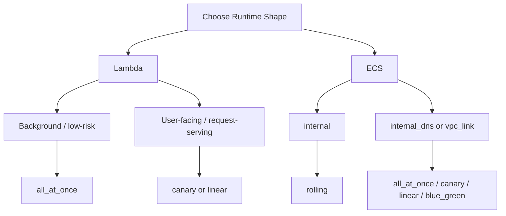

# aws-serverless-github-deploy

**Terraform + GitHub Actions for AWS serverless deployments.**  
Lambda + ECS with CodeDeploy rollouts, plus provisioned concurrency controls for Lambda — driven by clean module variables and `just` recipes.

## Sections

- [Overview](#overview)
- [Bootstrap-Friendly Plans](#bootstrap-friendly-plans)
- [Prerequisites](#prerequisites)
- [Setup](#setup)
- [Common Tasks](#common-tasks)
- [Local Development](#local-development)
- [Infra Deployment Use Cases](#infra-deployment-use-cases)
- [Reference](#reference)
- [Read This Next](#read-this-next)

## Overview

- Terraform/Terragrunt stacks for a typical AWS application shape: APIs, workers, frontend, database, auth, and messaging
- GitHub Actions workflows for infrastructure apply, artifact build, code deploy, and destroy
- shared deployment patterns for Lambda and ECS, with repo-local `just` commands for local and CI operations
- runtime and infrastructure layouts designed to be extended without having to rediscover the whole repo each time

## Bootstrap-Friendly Plans

This repo uses Terragrunt `dependency` wiring and plan-time mocks for bootstrap-sensitive cross-stack contracts.
See [infra/README.md](infra/README.md#dependency-notes) for the dependency strategy, mock-output rules, and saved-plan caveats.

Use [CONTRIBUTING.md](CONTRIBUTING.md) for expectations when changing the repo itself.

## Prerequisites

The AWS account must already have the landing-zone or StackSet network in place before deploying this repo.

- the Terraform in this repo reads the VPC and subnets with `data` sources rather than creating them
- the expected VPC and subnets must therefore already exist
- the private subnets must be tagged so the module lookups can find them, for example with names matching `*private*`
- if you plan to deploy the frontend custom domain, the matching Route53 hosted zone must also already exist
- the S3 Terraform state bucket should have bucket versioning enabled, because the repo uses the S3 backend lockfile path rather than DynamoDB state locking

If those shared network or DNS resources do not exist yet, the infra applies in this repo will fail during data lookup or certificate/DNS creation.

Required shared prerequisites before a full environment deploy:

- pre-existing VPC
- tagged private subnets that the data lookups can resolve
- Route53 hosted zone for the deployed frontend domain when using the frontend custom domain path

## Setup

### Setup Roles For CI

```sh
just tg ci aws/oidc apply
just tg dev aws/oidc apply
just tg prod aws/oidc apply
```

The `ci` OIDC role is intentionally narrower than the `dev` and `prod` roles.

Detailed scope:

- [infra/modules/aws/_shared/oidc/README.md](infra/modules/aws/_shared/oidc/README.md)

### Shared Platform Shape

Lambda and ECS APIs can coexist on the shared routing surface.

CloudFront exposes:

- Lambda-backed `/api/*` paths
- ECS-backed `/api/ecs/*` paths

Detailed routing and feasibility rules:

- [infra/modules/aws/network/README.md](infra/modules/aws/network/README.md)
- [infra/modules/aws/_shared/service/README.md](infra/modules/aws/_shared/service/README.md)
- [infra/modules/aws/_shared/task/README.md](infra/modules/aws/_shared/task/README.md)

## Common Tasks

The root [`justfile`](justfile) keeps local developer commands.

Split recipe files:

- CI-only helpers: [`justfile.ci`](justfile.ci)
- CI build/deploy helpers: [`justfile.deploy`](justfile.deploy)

Run split files locally with `--justfile`:

```sh
just --justfile justfile.ci tf-lint-check
just --justfile justfile.deploy lambda-get-version
just --justfile justfile.deploy frontend-build
```

### Local Plan Some Infra

Given a Terragrunt file is found at `infra/live/dev/aws/lambda_api/terragrunt.hcl`

```sh
just tg dev aws/lambda_api plan
```

Detailed Terragrunt graph and saved-plan helper commands live in [infra/README.md](infra/README.md#terragrunt-graph-helpers).

Placeholder app runtime tasks live with the code that owns them:

- Lambda API message publishing: [lambdas/lambda_api/README.md](lambdas/lambda_api/README.md)
- Lambda worker queue publishing: [lambdas/lambda_worker/README.md](lambdas/lambda_worker/README.md)
- ECS worker publishing, database verification, and debug shells: [containers/worker/README.md](containers/worker/README.md)
- Database migration runtime and invocation: [lambdas/migrations/README.md](lambdas/migrations/README.md)
- Frontend auth and API proxy behavior: [frontend/README.md](frontend/README.md)

## Local Development

Start the local stack:

```sh
just start
```

This starts local PostgreSQL, queue emulation, Lambda/ECS runtimes, migrations, the frontend dev server, and log tailing.

Stop the local stack and remove Compose volumes:

```sh
just stop
```

Run only the frontend dev server:

```sh
just frontend
```

Local service notes:

- frontend dev server and local API proxy: [frontend/README.md](frontend/README.md)
- Lambda runtime layout and local watch behavior: [lambdas/README.md](lambdas/README.md)
- ECS runtime layout and local watch behavior: [containers/README.md](containers/README.md)
- Lambda worker local queue publishing: [lambdas/lambda_worker/README.md](lambdas/lambda_worker/README.md)
- ECS worker local queue publishing and database verification: [containers/worker/README.md](containers/worker/README.md)

## Infra Deployment Use Cases

For focused infra changes such as:

- upgrading the database
- changing a Lambda env var
- adding an API route
- changing a security group

see [infra/README.md](infra/README.md#infra-deployment-use-cases).

## Reference

For Lambda provisioned concurrency patterns and example `provisioned_config` shapes, see:

- [infra/modules/aws/_shared/lambda/README.md](infra/modules/aws/_shared/lambda/README.md)

For ECS scaling patterns and `scaling_strategy` examples, see:

- [infra/modules/aws/_shared/service/README.md](infra/modules/aws/_shared/service/README.md)

### Deployment Model

Infrastructure apply and feature-code rollout are intentionally decoupled in this boilerplate.

- infra workflows create the stable runtime shape, including the Lambda and ECS CodeDeploy applications and deployment groups used later for real rollouts
- `*_infra` workflows apply infrastructure only
- `*_code` workflows deploy feature code only
- code deploy workflows publish the real Lambda versions and ECS task revisions into that pre-created deploy surface
- saved infra plans are stored as GitHub Actions artifacts keyed by workflow run id, with one run-level metadata artifact plus one per-stack plan artifact
- Code artifact retention and infra-plan retention are configured separately in the shared code bucket module
- rerunning infrastructure apply does not roll out new feature code
- the shared Lambda and ECS module READMEs are the canonical source for bootstrap, rollout, and rollback details for each runtime shape
- detailed workflow contracts, reusable-workflow inputs, repo-local action behavior, and `justfile_path` rules live in [.github/docs/README.md](.github/docs/README.md)
- see [lambdas/README.md](lambdas/README.md) and [containers/README.md](containers/README.md) for runtime source layout, build behavior, and boilerplate patterns

### Deployment Overview


```mermaid
flowchart TD
  start["Choose Runtime Shape"] --> lambda["Lambda"]
  start --> ecs["ECS"]

  lambda --> lambda_bg["Background / low-risk"]
  lambda --> lambda_api["User-facing / request-serving"]
  lambda_bg --> lambda_all["all_at_once"]
  lambda_api --> lambda_canary["canary or linear"]

  ecs --> ecs_internal["internal"]
  ecs --> ecs_lb["internal_dns or vpc_link"]
  ecs_internal --> ecs_roll["rolling"]
  ecs_lb --> ecs_cd["all_at_once / canary / linear / blue_green"]
```

## Read This Next

- CI contracts and feasibility checks: [.github/docs/README.md](.github/docs/README.md)
- Lambda source layout: [lambdas/README.md](lambdas/README.md)
- Container source layout: [containers/README.md](containers/README.md)
- Frontend source layout and local proxy: [frontend/README.md](frontend/README.md)
- Infra layout and stack glossary: [infra/README.md](infra/README.md)
- OIDC role ownership and setup contract: [infra/modules/aws/_shared/oidc/README.md](infra/modules/aws/_shared/oidc/README.md)
- Shared Lambda deployment and provisioned concurrency behavior: [infra/modules/aws/_shared/lambda/README.md](infra/modules/aws/_shared/lambda/README.md)
- Shared ECS deployment and scaling behavior: [infra/modules/aws/_shared/service/README.md](infra/modules/aws/_shared/service/README.md)
- Shared network and routing surface: [infra/modules/aws/network/README.md](infra/modules/aws/network/README.md)
- Frontend auth contract: [infra/modules/aws/cognito/README.md](infra/modules/aws/cognito/README.md)
- Frontend hosting contract: [infra/modules/aws/frontend/README.md](infra/modules/aws/frontend/README.md)
- Runtime log dashboard: [infra/modules/aws/observability/README.md](infra/modules/aws/observability/README.md)
