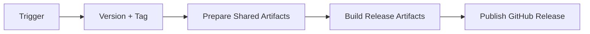
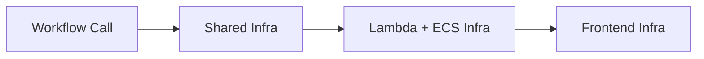
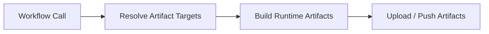
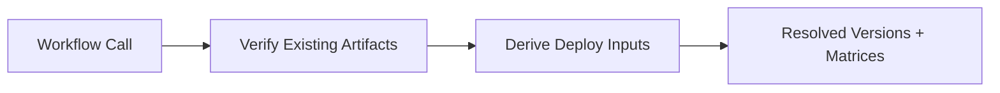
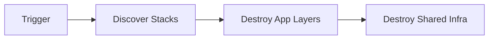

# CI Workflows

This document gives a lightweight view of the main GitHub Actions flows in this repo.

Each workflow is described in terms of:

- trigger
- process
- outcome

The diagrams are intentionally simple. They are meant to help someone understand what starts a workflow, what broad stages it runs through, and what it produces.

## Release

Trigger:

- push to `main`
- manual dispatch

Process:

- work out the next release tag
- create the tag when a new version is needed
- prepare shared CI artifact infrastructure
- build and publish release artifacts
- publish the GitHub release entry

Outcome:

- new git tag
- shared CI artifacts for Lambda, frontend, and ECS
- GitHub release notes

## Infra Artifact Prep

Workflow:

- `infra_releases.yml`

Trigger:

- called by infra/release wrapper workflows

Process:

- deploy or read shared CI-side ECR infrastructure
- push the bootstrap ECS image
- deploy or read the shared code bucket

Outcome:

- shared CI artifact infrastructure is ready for downstream build or infra workflows
- bootstrap ECS image is published

Reusable values:

- `repository_url`
- `bootstrap_image_uri`
- `code_bucket`

## Infra Apply

Workflow:

- `infra.yml`

Trigger:

- called by `deploy_dev_infra.yml`
- called by `deploy_prod_infra.yml`

Process:

- apply shared prerequisites such as OIDC, security, network, cluster, database, and worker messaging
- apply Lambda infrastructure
- apply ECS service infrastructure in bootstrap mode
- apply frontend infrastructure

Outcome:

- environment infrastructure updated
- bootstrap-ready ECS services

## Build

Workflow:

- `build.yml`

Trigger:

- called by `deploy_dev_code.yml`
- called by `release.yml`

Process:

- resolve shared artifact destinations
- build and upload frontend assets
- build and upload Lambda zips
- build and push ECS images

Outcome:

- uploaded frontend bundle
- uploaded Lambda artifacts
- pushed ECS images

## Build Resolve

Workflow:

- `build_get.yml`

Trigger:

- called by prod wrapper workflows
- called by dev code deploy after build

Process:

- verify released artifacts exist
- read bucket and ECR outputs
- derive Lambda, ECS task, and ECS service matrices

Outcome:

- a downstream deploy or infra wrapper has the artifact references and runtime matrices it needs to proceed

Reusable values:

- `code_bucket`
- `lambda_version_files`
- `ecs_image_uris`
- `ecs_task_matrix`
- `ecs_service_matrix`

## Code Deploy

Workflow:

- `deploy.yml`

Trigger:

- called by `deploy_dev_code.yml`
- called by `deploy_prod_code.yml`

Process:

- roll out Lambda code
- optionally invoke migrations
- register ECS task definitions
- deploy ECS services
- optionally deploy frontend assets

Outcome:

- updated running code in the target environment

## Destroy

Workflow:

- `destroy.yml`

Trigger:

- manual dispatch

Process:

- discover active stacks
- destroy app/runtime layers first
- destroy shared infrastructure after downstream consumers are gone

Outcome:

- selected environment torn down

## Wrapper Workflows

These are the workflows most users are likely to trigger directly.

### `deploy_dev_infra.yml`

Trigger:

- manual dispatch

Process:

- discover directories
- prepare dev artifact infrastructure
- apply dev infrastructure

Outcome:

- dev infrastructure updated

### `deploy_prod_infra.yml`

Trigger:

- manual dispatch

Process:

- resolve release artifacts from `ci`
- apply prod infrastructure

Outcome:

- prod infrastructure updated

### `deploy_dev_code.yml`

Trigger:

- manual dispatch

Process:

- discover directories
- build fresh dev artifacts
- resolve deploy inputs
- deploy code to dev

Outcome:

- dev Lambda, ECS, and frontend code updated

### `deploy_prod_code.yml`

Trigger:

- manual dispatch

Process:

- resolve release artifacts from `ci`
- deploy code to prod

Outcome:

- prod Lambda, ECS, and frontend code updated

## Discovery Helper

Workflow:

- `get_directories.yml`

Purpose:

- derive the directory-based matrices used by the wrapper workflows

Outcome:

- wrapper workflows receive the directory-derived matrices they need to continue

Reusable values:

- `lambda_dirs`
- `task_dirs`
- `ecs_service_dirs`
- `container_dirs`
