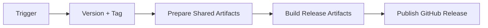
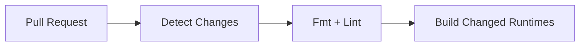
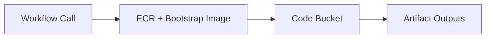
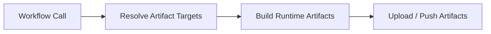
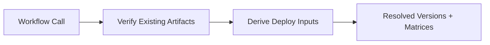
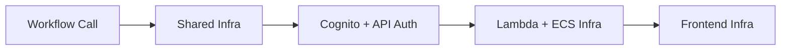
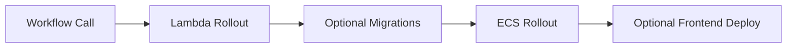
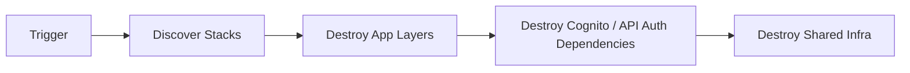

# CI Workflows

This document gives a lightweight view of the main GitHub Actions flows in this repo.

Use it in this order:

- start with the grouped workflow sections below
- use the Mermaid diagram in each section for the fast path
- use the trigger/process/outcome bullets only when you need more detail

The diagrams are intentionally simple. They show what starts a workflow, the broad stages it runs through, and what it produces.

## Workflow Groups

- Release and validation: `release.yml`, `pull_request.yml`
- Shared artifact prep and build: `infra_releases.yml`, `build.yml`, `build_get.yml`
- Infra and code rollout: `infra.yml`, `deploy.yml`
- Entry-point wrappers: `deploy_dev_infra.yml`, `deploy_prod_infra.yml`, `deploy_dev_code.yml`, `deploy_prod_code.yml`
- Cleanup and discovery: `destroy.yml`, `get_directories.yml`

## Release And Validation

### Release

Trigger:

- push to `main`
- manual dispatch

Process:

- work out the next release tag
- create the tag when a new version is needed
- prepare shared CI artifact infrastructure
- build and publish release artifacts
- publish the GitHub release entry

Outcome:

- new git tag
- shared CI artifacts for Lambda, frontend, and ECS
- GitHub release notes

### Pull Request Checks

Workflow:

- `pull_request.yml`

Trigger:

- pull request opened, updated, reopened, or marked ready for review

Process:

- check title and changed-file categories
- run workflow formatting and Terraform linting when infra files changed
- build changed Lambdas, ECS images, and frontend assets

Outcome:

- fast PR feedback on workflow syntax, Terraform linting, and buildability before deploy-time workflows run

## Shared Artifact Prep And Build

### Infra Artifact Prep

Workflow:

- `infra_releases.yml`

Trigger:

- called by infra/release wrapper workflows

Process:

- deploy or read shared CI-side ECR infrastructure
- push the bootstrap ECS image
- deploy or read the shared code bucket

Outcome:

- shared CI artifact infrastructure is ready for downstream build or infra workflows
- bootstrap ECS image is published

Reusable values:

- `repository_url`
- `bootstrap_image_uri`
- `code_bucket`

### Build

Workflow:

- `build.yml`

Trigger:

- called by `deploy_dev_code.yml`
- called by `release.yml`

Process:

- resolve shared artifact destinations
- build and upload frontend assets
- build and upload Lambda zips
- build and push ECS images

Outcome:

- uploaded frontend bundle
- uploaded Lambda artifacts
- pushed ECS images

### Build Resolve

Workflow:

- `build_get.yml`

Trigger:

- called by prod wrapper workflows
- called by dev code deploy after build

Process:

- verify released artifacts exist
- read bucket and ECR outputs
- derive Lambda, ECS task, and ECS service matrices

Outcome:

- a downstream deploy or infra wrapper has the artifact references and runtime matrices it needs to proceed

Reusable values:

- `code_bucket`
- `lambda_version_files`
- `ecs_image_uris`
- `ecs_task_matrix`
- `ecs_service_matrix`

## Infra And Code Rollout

### Infra Apply

Workflow:

- `infra.yml`

Trigger:

- called by `deploy_dev_infra.yml`
- called by `deploy_prod_infra.yml`

Process:

- apply shared prerequisites such as OIDC, Cognito, security, network, cluster, database, and worker messaging
- apply Lambda infrastructure against the shared network/API surface
- apply ECS service infrastructure in bootstrap mode without waiting on unrelated Lambda stacks
- apply frontend infrastructure from network and Cognito outputs

Outcome:

- environment infrastructure updated
- bootstrap-ready ECS services

### Code Deploy

Workflow:

- `deploy.yml`

Trigger:

- called by `deploy_dev_code.yml`
- called by `deploy_prod_code.yml`

Process:

- roll out Lambda code
- optionally invoke migrations
- register ECS task definitions
- deploy ECS services
- optionally deploy frontend assets

Outcome:

- updated running code in the target environment

## Wrapper Workflows

These are the workflows most users are likely to trigger directly.

### `deploy_dev_infra.yml`

Trigger:

- manual dispatch

Process:

- discover directories
- prepare dev artifact infrastructure
- apply dev infrastructure

Outcome:

- dev infrastructure updated

### `deploy_prod_infra.yml`

Trigger:

- manual dispatch

Process:

- resolve release artifacts from `ci`
- apply prod infrastructure

Outcome:

- prod infrastructure updated

### `deploy_dev_code.yml`

Trigger:

- manual dispatch

Process:

- discover directories
- build fresh dev artifacts
- resolve deploy inputs
- deploy code to dev

Outcome:

- dev Lambda, ECS, and frontend code updated

### `deploy_prod_code.yml`

Trigger:

- manual dispatch

Process:

- resolve release artifacts from `ci`
- deploy code to prod

Outcome:

- prod Lambda, ECS, and frontend code updated

## Cleanup And Discovery

### Destroy

Workflow:

- `destroy.yml`

Trigger:

- manual dispatch

Process:

- discover active stacks
- destroy app/runtime layers first
- destroy auth and shared infrastructure after downstream consumers are gone

Outcome:

- selected environment torn down

### Discovery Helper

Workflow:

- `get_directories.yml`

Purpose:

- derive the directory-based matrices used by the wrapper workflows

Outcome:

- wrapper workflows receive the directory-derived matrices they need to continue

Reusable values:

- `lambda_dirs`
- `task_dirs`
- `ecs_service_dirs`
- `container_dirs`
